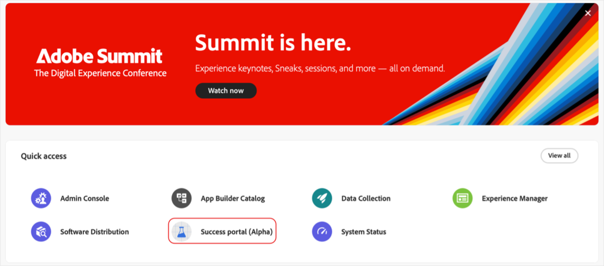

# [!DNL Adobe Success] ポータルへのアクセス

このガイドでは、[!DNL Adobe Success] ポータルにログインし、アクセスに関する問題が発生した場合にサポートを受ける方法について説明します。

アクセスを確認する通知が **[!UICONTROL Success]** ポータルチームから届きます。このメッセージには、ログインの詳細が含まれます。

1. [https://experience.adobe.com/](https://experience.adobe.com/) に移動します。
1. Adobe ID を使用してログインします。
1. **[!UICONTROL Success ポータル（Alpha）]** アイコンを選択します。

   

1. ログインすると、次の 5 つのタブが表示されます。

   

   * ホーム
   * **[!UICONTROL アクションプラン]**
   * **[!UICONTROL 値トラッカー]**
   * **[!UICONTROL サポートとインサイト]**
   * **[!UICONTROL Support エンゲージメントプラン]**

## トラブルシューティングとサポート

ポータルまたはその機能にアクセスする際に問題が発生した場合は、[Alpha チームチャネル](https://teams.microsoft.com/l/channel/19:h-GcuAZs9uF05rervqTdx2U27ohYINuRUIfbMte9B-U1@thread.tacv2/General?groupId=02b87789-3475-47e4-94c1-0981f63ae89f&tenantId=fa7b1b5a-7b34-4387-94ae-d2c178decee1)を使用してアドビのチームにお問い合わせください。

ポータルにある「**[!UICONTROL Alpha フィードバック]**」ボタンを使用して、フィードバックを送信できます。

>[!NOTE]
>
>フィードバックツールは、専用のサポートチャネルではありません。緊急のログインに関する問題には適していません。

