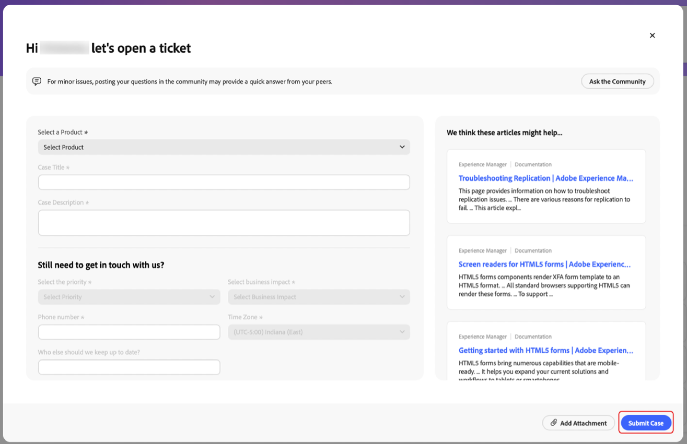
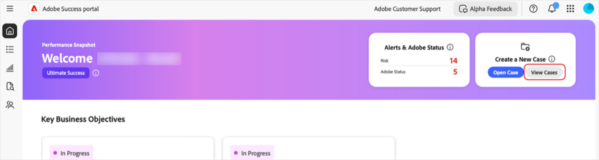

# [!DNL Adobe Success] ポータルでのケースの作成とケースの管理

このガイドでは、[!DNL Adobe Success] ポータルでケースのレポートを作成、表示、ダウンロードする方法について説明します。

## ケースを開く

「ホーム」タブまたは「**[!UICONTROL サポートとインサイト]**」タブからケースを開くことができます。

「ホーム」タブから&#x200B;**[!UICONTROL ケースを開く]**&#x200B;ページにアクセスするには：

1. 「ホーム」タブに移動します。
1. 「**[!UICONTROL ケースを開く]**」を選択します。

   

1. 次の必須のフィールドに入力します。
   1. **[!UICONTROL 製品を選択]**。
   1. **[!UICONTROL ケースのタイトル]**。
   1. **[!UICONTROL ケースの説明]**。
1. 「**[!UICONTROL ケースを送信]**」を選択します。

   

「**[!UICONTROL サポートとインサイト]**」タブから&#x200B;**[!UICONTROL ケースを開く]**&#x200B;ページにアクセスするには：

1. 「**[!UICONTROL サポートとインサイト]**」タブに移動します。
1. 「**[!UICONTROL ケースを開く]**」を選択します。

   

上記と同じ手順に従って、ケースを完了し、送信します。

## ケースを表示

「ホーム」タブまたは「**[!UICONTROL サポートとインサイト]**」タブからケースを表示できます。

「ホーム」タブから&#x200B;**[!UICONTROL ケースを表示]**&#x200B;ページにアクセスするには：

1. 「ホーム」タブに移動します。
1. 「**[!UICONTROL ケースを表示]**」を選択します。

   

1. 表示する製品カードを選択し、「**[!UICONTROL オープンケース]**」または「**[!UICONTROL クローズ済みケース]**」を選択します。

   >[!NOTE]
   >
   >また、「**[!UICONTROL サポートとインサイト]**」タブを選択すると、**[!UICONTROL オープンケース]**&#x200B;または&#x200B;**[!UICONTROL クローズ済みケース]**&#x200B;リンクを使用して、製品カードにすばやくアクセスすることもできます。

   

1. **[!UICONTROL ケース番号]**&#x200B;をクリックすると、ケースの詳細が表示されます。

   

## ケースレポートのダウンロード

ユースケースに関する PDF レポートをダウンロードするには：

1. 「ホーム」タブに移動します。
1. 「**[!UICONTROL ケースを表示]**」を選択します。

   

1. 表示する製品カードを選択し、「**[!UICONTROL オープンケース]**」または「**[!UICONTROL クローズ済みケース]**」を選択します。

   >[!NOTE]
   >
   >また、「**[!UICONTROL サポートとインサイト]**」タブを選択すると、**[!UICONTROL オープンケース]**&#x200B;または&#x200B;**[!UICONTROL クローズ済みケース]**&#x200B;へのリンクを使用して、製品カードにすばやくアクセスすることもできます。

   

1. [製品] - サポートケースページで、ダウンロードするケースの横にあるチェックボックスをオンにして、「**[!UICONTROL ケースをダウンロード]**」を選択します。

   
