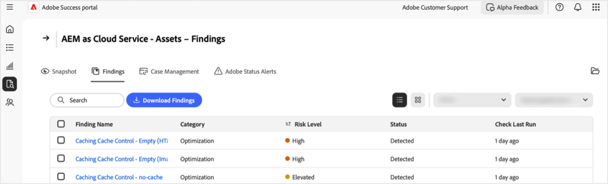

# [!DNL Adobe Success] ポータルでの結果の管理

このガイドでは、製品のパフォーマンス、セキュリティ、機能に関するリスクをプロアクティブに管理するのに役立つ、[!DNL Adobe Success] ポータルの結果にアクセス、解釈、対応する方法について説明します。

[!DNL Adobe Success] ポータル **[!UICONTROL 結果]** ページには、Adobe製品インスタンスで検出された問題またはリスクが表示されます。 調査結果には、パフォーマンス、セキュリティ、機能の問題のほか、そのステータスとリスクレベルが含まれます。 このページを監視すると、環境に影響を与える前に問題に早期に対処できます。

**結果とは**

結果は、[!DNL Adobe Success] ポータルに表示されるサポートインサイトアラートです。 パフォーマンスの低下、セキュリティのリスク、誤った設定など、Adobe製品の設定で発生する可能性のある問題がハイライト表示されます。 これらのアラートは、API、[!DNL New Relic]、[!DNL Splunk] などのツールから収集されたテレメトリデータに基づいています。

**調査結果はどのように作成されますか？**

Adobe チームは、最も一般的なサポートの問題とトレンドを定期的に調査しています。 インサイトに基づいて、システムに新しいチェックを追加します。 [!DNL Adobe Success] portal は 1 日 1 回、製品データをスキャンして、設定の誤り、ジョブの停止、システムの停止につながる可能性のあるすべての問題を検出します。 チェックが（Adobeの製品およびサポートチームが定義した）安全範囲外の項目を検出した場合、それは検索結果として表示されます。

**調査結果が重要な理由**

調査結果を定期的に確認することで、システムや顧客に影響を与える前に、問題を早期に発見するのに役立ちます。 このプロアクティブなアプローチは、システムの安定性を向上し、ダウンタイムを削減し、ベストプラクティスをサポートします。

**結果を修正する方法**

各検索結果には、問題の解決方法に関する推奨事項と明確な手順、および関連ドキュメント（利用可能な場合）へのリンクが含まれます。 これらの調査結果を IT、エンジニアリングチーム、またはAdobe パートナーと共有し、連携して対処します。 これらの問題を早期に修正することで、大きな問題を防ぎ、システムをスムーズに実行し続けることができます。

## アクセスの結果

製品のインサイトを表示するには：

1. **[!UICONTROL サポートとインサイト]** に移動します。
1. 関連する製品カードを選択します。 「**[!UICONTROL 結果]**」タブを選択します。

   

1. 選択した製品のすべての結果のリストが表示されます。

   

1. ここから、次のことができます。

   

   * 特定のエントリを検索します。
   * 「**[!UICONTROL 結果をダウンロード]**」を選択して、結果のリストをエクスポートします。 1 つの検索結果に対してレポートを書き出すには、「検索名 **[!UICONTROL 列で、該当する検索結果の横にあるチェックボックスを選択し]** す。 結果を選択しない場合、PDFにはデフォルトですべての結果のリストが含まれています。
   * **[!UICONTROL 検索名]** の下で検索を選択することで推奨される解像度を含め、検索の詳細を確認します。 検索詳細ページには、選択した検索結果が追加のコンテキストと推奨事項と共に表示されます。 このレポートを表示するには、ダウンロード矢印を選択します。

     

## アクションの結果

次の手順に従って、各検索結果が引き続き適用されるか、却下できるかを検証します。

>[!NOTE]
>：
>
>インスタンスに対して標準チェックが実行されます。 チェックで、インスタンスに問題が存在しないことが判明しない場合は、**[!UICONTROL 検出されませんでした]** ステータスがあります。

1. **[!UICONTROL サポートとインサイト]** に移動します。
1. 関連する製品カードを選択します。
1. 「**[!UICONTROL 結果]**」タブを開きます。 選択した製品のすべての結果が表示されます。
1. **[!UICONTROL 検索名]** の下でエントリを選択します。 検索詳細ページでは、次の操作を実行できます。
   * 「**[!UICONTROL 検証]**」を選択して、イシューがまだ存在するかどうかを確認します（「**[!UICONTROL 検証]**」ボタンは、イシューが解決されたことを確認するように設計されています）。

   

   * それでも問題が解決しない場合は、次のメッセージが表示されます。*[!UICONTROL 検証が完了しました。 が引き続き検出されました]*. 結果の詳細ページの情報と推奨事項を使用して、調査と解決をおこないます。
   * 問題が発生しなくなった場合は、次のメッセージが表示されます。*[!UICONTROL 検証が完了しました。 が検出されませんでした]*. 結果が検出されなくなった場合、結果はグレー表示され、ステータスは **[!UICONTROL 未検出]** に変わります。 「**[!UICONTROL 検出されませんでした]**」ステータスの結果は、結果リストの下部にあります。
   * イシューが適用されない場合や関連しない場合は、「解除 **[!UICONTROL を選択してイシューを解除でき]** す。 検索結果が閉じられると、検索結果がグレー表示され、ステータスが **[!UICONTROL 閉じられた]** に変わります。  **[!UICONTROL 却下]** ステータスの結果は、結果リストの下部にあります。

## 結果について

* **[!UICONTROL 名前を検索]** – 詳細なインサイトと推奨される解決手順を表示する場合に選択します。
* **[!UICONTROL タイプ]** - *機能*、*パフォーマンス* および *セキュリティ* に分類されます。
* **[!UICONTROL リスクレベル]** – 重大度インジケーター、視覚的な指標。
* **[!UICONTROL ステータス]** – 検索結果の現在の状態（例：*検出済み*、*未検出*、*却下*）。
* **[!UICONTROL Check Last Run]** – 前回、結果を更新したチェックのタイムスタンプ。

## ベストプラクティス

**[!UICONTROL 結果]** ページには、次のリスクレベルを持つ推奨事項が記載されています：**[!UICONTROL 高]**、**[!UICONTROL 管理者特権]**、**[!UICONTROL Medium]**。 **[!UICONTROL 高]** は重要で、**[!UICONTROL 高]** は緊急で、**[!UICONTROL Medium]** は重要ではありません。 サイトの正常性とパフォーマンスを維持するには：

* **[!UICONTROL 高リスク]** の調査結果に迅速に対処し、重大な脅威を引き起こします。
* **[!UICONTROL 昇格]** のリスク問題を即座に解決して、エスカレーションを回避します。
* **[!UICONTROL Medium]** のリスク結果を定期的にモニタリングし、必要に応じて対応する。

