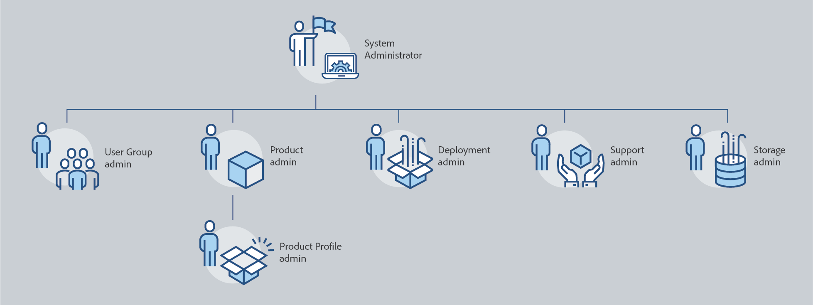
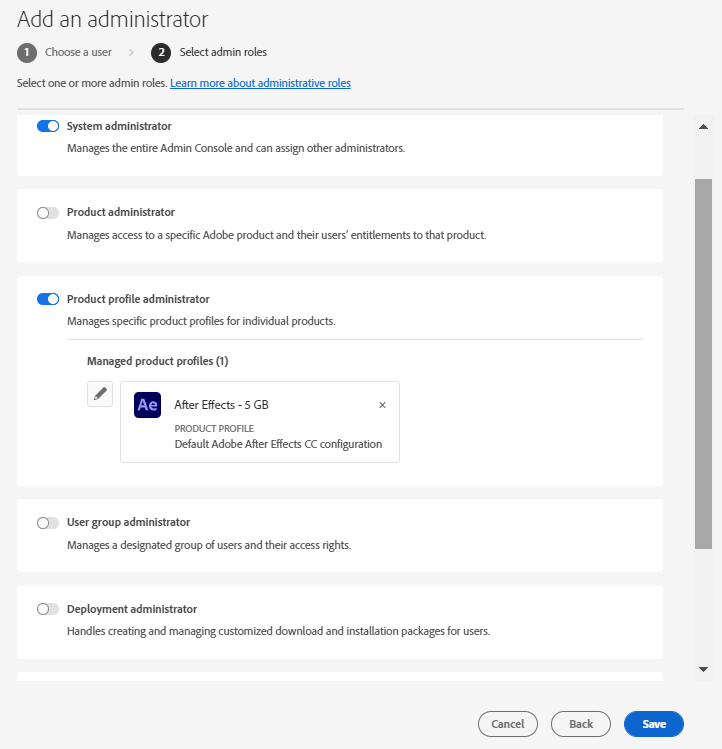
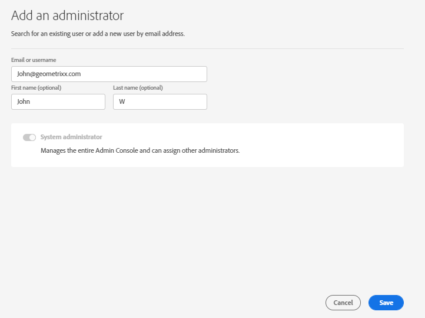
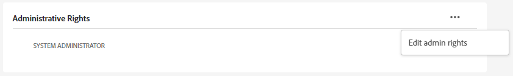
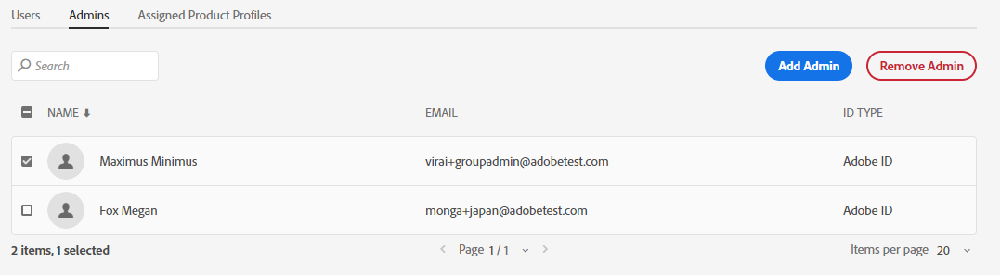

# 一般社員

Adobe Admin Consoleを活用することで、企業はAdobe製品へのアクセスと使用をきめ細かく管理できる、柔軟な管理階層を定義できます。 エンタープライズオンボーディングプロセスでプロビジョニングされた1人以上のシステム管理者は、階層の最上位に位置します。 これらのシステム管理者は、引き続き全体的な制御を維持しながら、他の管理者に責任を委任できます。

管理者の役割は、企業に次のような主なメリットをもたらします。

* 管理上の責任の管理された分散化
* 製品の割り当てをユーザー別、製品別にすばやく表示
* 製品管理者に割り当て量を割り当てる機能

## 管理階層

適用対象：Adobe エンタープライズ版のお客様。

管理階層は、企業の固有の要件に合わせて使用できます。 例えば、Adobe Creative CloudとAdobe Marketing Cloudの機能に対する使用権限を管理する管理者を、それぞれ異なる管理者に任命できます。 別の方法として、企業は異なる事業部に属するユーザーの使用権限を管理するために、異なる管理者を持つことができます。

>[!NOTE]
>
>管理階層は、グループ版のお客様には適用されません。 グループ版のお客様は、単一の&#x200B;**システム管理者**&#x200B;の役割を持っています。 契約所有者（_以前は&#x200B;**プライマリ管理者**&#x200B;_）は、契約詳細と請求履歴にアクセスできるシステム管理者です。 現在の契約所有者である場合は、既存のシステム管理者（_&#x200B;以前は&#x200B;**セカンダリ管理者**&#x200B;_）を契約所有者として指名できます。

_管理者ロール階層_

| 役割 | 説明 |
|--- |--- |
| **システム管理者** | 組織のスーパーユーザー。Admin Consoleですべての管理タスクを実行できます。 また、製品管理者、製品プロファイル管理者、ユーザーグループ管理者、デプロイメント管理者、サポート管理者など、次の管理機能を他のユーザーに委任する権限があります。 |
| **製品管理者** | その管理者に割り当てられた製品と関連するすべての管理機能を管理します。これには次のものが含まれます。<ul><li>製品プロファイルの構築</li><li>組織にユーザーとユーザーグループを追加しますが、これらを削除しません</li><li>製品プロファイルへのユーザーとユーザーグループの追加または削除</li><li>製品プロファイルから製品プロファイル管理者を追加または削除する</li><li>製品に他の製品管理者を追加または削除する</li><li>グループへのグループ管理者の追加または削除</li></ul> |
| **製品プロファイル管理者** | その管理者に割り当てられた製品プロファイルの説明と、関連するすべての管理機能を管理します。これには次のものが含まれます。<ul><li>組織にユーザーとユーザーグループを追加しますが、これらを削除しません</li><li>製品プロファイルへのユーザーとユーザーグループの追加または削除</li><li>製品プロファイルからユーザーおよびユーザーグループに製品の権限を割り当てまたは取り消します</li><li>製品プロファイルのユーザーとユーザーグループの製品ロールの管理 |
| **ユーザーグループ管理者** | その管理者に割り当てられたユーザーグループの説明と、関連するすべての管理機能を管理します。これには次のものが含まれます。<ul><li>グループへのユーザーの追加または削除</li><li>グループへのユーザーグループ管理者の追加または削除 |
| **デプロイメント管理者** | ソフトウェアパッケージとアップデートをエンドユーザー向けに作成、管理、デプロイします。 |
| **管理者をサポート** | お客様から報告された問題レポートなど、サポート関連の情報にアクセスできる管理者以外の役割。 |
| **ストレージ管理者** | 組織のストレージ管理を管理します。 管理者は、アクティブなユーザーと非アクティブなユーザーの両方のストレージ消費量を表示し、コンテンツを他の受信者に転送できます。 |

各管理者ロールの権限と権限の詳細なリストについては、[権限](#enterprise-admins-permissions-matrix)を参照してください。

## エンタープライズ管理者の役割の追加 {#add-enterprise-role}

適用対象：Adobe エンタープライズ版のお客様。

管理者は、他のユーザーに管理者ロールを割り当てて、自分と同じ権限を与えたり、前述の[に記載されているように、階層の管理者ロールの下にある役割に対する権限を与えたりできます](#administrative-hierarchy)。 例えば、製品の管理者は、製品の管理者権限または製品プロファイルの管理者権限をユーザーに付与できますが、デプロイメントの管理者権限は付与できません。 Admin Consoleの権限については、[権限マトリックス &#x200B;](#enterprise-admins-permissions-matrix)を参照してください。

管理者を追加または招待するには：

1. **[Adobe Admin Console](https://adminconsole.adobe.com/)**&#x200B;で、**[!UICONTROL Users]** > **[!UICONTROL Administrators]**&#x200B;を選択します。

   または、関連する製品、製品プロファイルまたはユーザーグループに移動し、**[!UICONTROL 管理者]** タブに移動します。

1. 「**[!UICONTROL 管理者を追加]**」をクリックします。
1. 名前または電子メールアドレスを入力します。 有効なメールアドレスを指定し、画面に表示される情報を入力することで、既存のユーザーを検索したり、新しいユーザーを追加したりできます。
1. 「**[!UICONTROL 次へ]**」をクリックします。 管理者の役割のリストが表示されます。

   >[!NOTE]
   >
   >* この画面のオプションは、アカウントと管理者の役割によって異なります。 自分と同じ権限を与えることも、階層内の自分の役割に対する権限を与えることもできます。
   >* チームのシステム管理者として割り当てることができるのは、システム管理者の1つの管理者ロールのみです。

1. 1つ以上の管理者ロールを選択します。
1. 製品管理者、製品プロファイル管理者、ユーザーグループ管理者などの管理者タイプの場合は、それぞれ特定の製品、プロファイル、グループを選択します。

   >[!NOTE]
   >
   >製品プロファイル管理者の場合は、複数の製品のプロファイルを含めることができます。

   

1. ユーザーに割り当てられた管理者ロールを確認し、**[!UICONTROL 保存]**&#x200B;をクリックします。

ユーザーは、新しい管理者権限に関する招待メールを`message@adobe.com`から受け取ります。

ユーザーが組織に参加するには、メール内の&#x200B;**[!UICONTROL 開始]**&#x200B;をクリックする必要があります。 新しい管理者が電子メールの招待状に「**[!UICONTROL はじめに]**」リンクを使用しない場合、Admin Consoleにログインできません。

サインインプロセスの一環として、Adobe プロファイルを既にお持ちでない場合は、設定するように求められる場合があります。 ユーザーがメールアドレスに複数のプロファイルを関連付けている場合、ユーザーは「チームに参加」を選択し（プロンプトが表示された場合）、新しい組織に関連付けられているプロファイルを選択する必要があります。

## グループ管理者の追加 {#add-admin-teams}

適用対象：Adobe teamsのお客様。

管理者は、システム管理者の役割を他のユーザーに割り当てて、自分と同じ権限を与えることができます。

システム管理者を追加または招待するには：

1. **[!UICONTROL Adobe Admin Console]**&#x200B;で、**[!UICONTROL Users]** > **[!UICONTROL Administrators]**&#x200B;を選択します。

   既存の管理者のリストが表示されます。

1. 「**[!UICONTROL 管理者を追加]**」をクリックします。

   **[!UICONTROL 管理者を追加]**&#x200B;画面が表示されます。

1. 名前または電子メールアドレスを入力します。 有効なメールアドレスを指定し、画面に表示される情報を入力することで、既存のユーザーを検索したり、新しいユーザーを追加したりできます。

   デフォルトでは、システム管理者が選択されています。

1. 「**[!UICONTROL 保存]**」をクリックします。

グループ組織内のすべてのユーザーはBusiness ID ユーザーであるため、新しい管理者権限に関する招待メールを`message@adobe.com`から受け取ります。
ユーザーが組織に参加するには、メール内の&#x200B;**[!UICONTROL 開始]**&#x200B;をクリックする必要があります。

サインインプロセスの一環として、Adobe プロファイルを既にお持ちでない場合は、設定するように求められる場合があります。 ユーザーがメールアドレスに複数のプロファイルを関連付けている場合、ユーザーは「チームに参加」を選択し（プロンプトが表示された場合）、新しい組織に関連付けられているプロファイルを選択する必要があります。

## エンタープライズ管理者の役割の編集

適用対象：Adobe エンタープライズ版のお客様。

管理者は、管理階層の下位にある別の管理者の管理者ロールを編集できます。 例えば、他の管理者の管理者権限を削除できます。

管理者の役割を編集するには：

1. **[!UICONTROL Adobe Admin Console]**&#x200B;で、**[!UICONTROL Users]** > **[!UICONTROL Administrators]**&#x200B;を選択します。 既存の管理者のリストが表示されます。

   または、関連する製品、製品プロファイルまたはユーザーグループに移動し、**[!UICONTROL 管理者]** タブに移動します。

1. 編集する管理者の名前をクリックします。
1. **[!UICONTROL ユーザーの詳細]**&#x200B;で、 セクションの&#x200B;**アイコン**&#x200B;をクリックし、**[!UICONTROL 管理者権限の編集]**&#x200B;を選択します。

   

1. 管理者権限を編集し、変更を保存します。

## チーム管理者の役割の編集

適用対象：Adobe teamsのお客様。

グループ版システム管理者は、他の管理者のシステム管理者権限を削除できます。

システム管理者権限を取り消すには：

1. **[!UICONTROL Adobe Admin Console]**&#x200B;で、**[!UICONTROL Users]** > **[!UICONTROL Administrators]**&#x200B;を選択します。

   既存の管理者のリストが表示されます。

1. **[!UICONTROL ユーザーの詳細]**&#x200B;で、 セクションの右側にある&#x200B;**[!UICONTROL アイコン]**&#x200B;をクリックし、**[!UICONTROL 管理者権限を編集]**&#x200B;を選択します。

   

1. 管理者権限を編集し、変更を保存します。

## 管理者の削除

適用対象：Adobe teams エンタープライズ版のお客様。

管理者権限を取り消すには、ユーザーを選択し、**[!UICONTROL 管理者を削除]**&#x200B;をクリックします。

>[!NOTE]
>
>管理者を削除しても、そのユーザーはAdmin Consoleから削除されず、管理者ロールに関連付けられている権限のみが削除されます。

## エンタープライズ管理者権限マトリックス

適用対象：Adobe エンタープライズ版のお客様。

次の表に、管理者の様々なタイプに対するすべての権限を、次の機能領域で分類して示します。

### ID 管理

| 権限 | システム管理者 | サポート管理者 |
|--- |--- |--- |
| ドメインの追加（ドメインのリクエスト/クレーム） | ✔ | |
| ドメインとドメインのリストを表示 | ✔ | |
| ドメイン暗号化キーの管理 | ✔ | |
| デフォルトの組織パスワードポリシーの管理 | ✔ | |
| デフォルトの組織パスワードポリシーの表示 | ✔ | |

### ユーザー管理

| 権限 | システム管理者 | サポート管理者 |
|--- |--- |--- |
| 組織にユーザーを追加 | ✔ | |
| 組織からユーザーを削除 | ✔ | |
| ユーザーの詳細とリストの表示 | ✔ | |
| ユーザープロファイルの編集 | ✔ | |
| ユーザーまたはグループへの製品プロファイルの追加 | ✔ | |
| ユーザーまたはグループへの製品プロファイルの削除 | ✔ | |
| 複数のユーザーへの製品プロファイルの追加 | ✔ | |
| ユーザーの製品プロファイルの表示 | ✔ | |
| 製品ユーザーのリストを表示 | ✔ | |
| 組織へのユーザーの一括追加 | ✔ | |

### 管理者管理

| 権限 | システム管理者 | サポート管理者 |
|--- |--- |--- |
| ユーザーへの組織管理者の付与 | ✔ | |
| ユーザーから組織管理者を取り消す | ✔ | |
| 製品ライセンス管理者をユーザーに付与する | ✔ | |
| ユーザーから製品ライセンス管理者を取り消す | ✔ | |
| ユーザーへのデプロイメント管理者の付与 | ✔ | |
| ユーザーからデプロイメント管理者を取り消す | ✔ | |
| ユーザーにユーザーグループ管理者を付与する | ✔ | |
| ユーザーからユーザーグループ管理者を取り消す | ✔ | |
| ユーザーにプロダクトオーナー管理者を付与する | ✔ | |
| ユーザーからプロダクトオーナー管理者を取り消す | ✔ | |

### 製品ライセンス設定の管理

| 権限 | システム管理者 | サポート管理者 |
|--- |--- |--- |
| 組織への製品使用権限の付与 | | |
| 組織から製品の使用権限を削除 | | |
| 組織が所有するライセンスの合計数を表示します | ✔ | |
| 利用可能な製品と製品ファミリーの表示 | ✔ | |
| 製品ライセンスの説明/データの編集 | ✔ | |
| ユーザーに製品ライセンスを提供する | ✔ | |
| ユーザーからの製品ライセンスのプロビジョニング解除 | ✔ | |
| 新しい製品ライセンス設定の追加 | ✔ | |
| 製品ライセンスサービス設定の編集 | ✔ | |
| 製品ライセンスサービス設定の削除 | ✔ | |
| ユーザーからの製品アクセスの削除（すべての設定から削除） | ✔ | |

### ストレージ管理

| 権限 | システム管理者 | サポート管理者 |
|--- |--- |--- |
| アクティブおよび非アクティブなユーザーフォルダーの表示 | ✔ | |
| 非アクティブなユーザーフォルダーの削除とコンテンツの転送 | ✔ | |

### デプロイメント

| 権限 | システム管理者 | サポート管理者 |
|--- |--- |--- |
| 「パッケージ」タブの表示/使用 | ✔ | |

### サポート

| 権限 | システム管理者 | サポート管理者 |
|--- |--- |--- |
| 「サポート」タブを表示 | ✔ | |
| サポートケースの管理 | ✔ | ✔ |

### ユーザーグループ管理

| 権限 | システム管理者 | サポート管理者 |
|--- |--- |--- |
| ユーザーグループの作成 | ✔ | |
| ユーザーグループの削除 | ✔ | |
| ユーザーグループにユーザーを追加 | ✔ | |
| ユーザーグループからユーザーを削除 | ✔ | |
| 製品ライセンスへのユーザーグループの割り当て | ✔ | |
| 製品ライセンスからユーザーグループを削除 | ✔ | |
| ユーザーグループのメンバーを表示 | ✔ | ✔ |
| ユーザーグループのリストの表示 | ✔ | ✔ |
