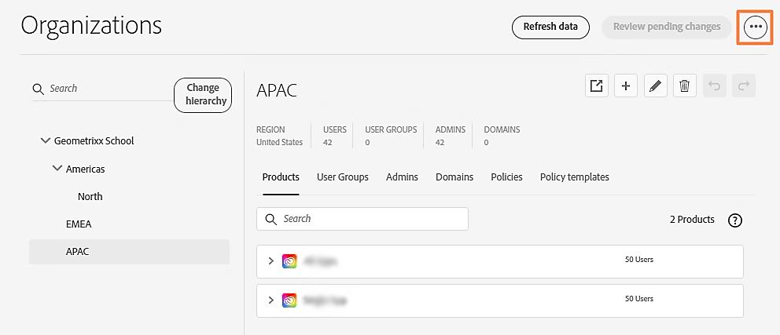

# 組織構造と製品割り当てのエクスポートまたはインポート

**適用先：** Enterprise

Global Admin Consoleの書き出し機能と読み込み機能を使用して、グローバル管理者が組織管理と製品管理を効率化する方法について説明します。

**[!UICONTROL Global Admin Console]**&#x200B;の「[組織](https://helpx.adobe.com/jp/enterprise/global-admin-console/adopt-global-administration.html)」タブにアクセスして、組織構造を書き出すか、読み込みます。 割り当てデータの「**[!UICONTROL 製品割り当て]**」タブに移動します。 **[!UICONTROL 詳細オプション]** **⋮** アイコンを使用して、書き出しまたは読み込みを選択します。 [Global Admin Consoleにログイン &#x200B;](https://global-admin-console.adobe.com)。

## 組織構造の書き出し

[&#x200B; グローバル管理者](https://helpx.adobe.com/jp/enterprise/global-admin-console/manage-administrators.html)として、組織階層を書き出すことができます。 組織階層全体またはそのサブセットのJSON、CSV、またはXLSX表現をダウンロードできます。 このデータは、分析や修正に使用できます。

選択した書き出し形式は、書き出したデータの構造に影響します。

- CSV形式：一度に1種類のデータのみを書き出すことができます。 製品プロファイルをCSV形式で書き出すと、プロファイルとリソースが1つのテーブルにまとめられます。 製品プロファイルには、リソースごとに1つずつ、複数のエントリがあります。
- XLSX形式：各組織の詳細が別のシートに表示されます。 レコードは、参照IDによって異なるオブジェクトタイプ間で接続されます。 場合によっては、特定のオブジェクトに複数の行が存在することがあります（例えば、特定のリソースに関連付けられた一連の値がある場合のリソースオブジェクト）。
- JSON形式：最も柔軟な形式 書き出されたオブジェクト間の構造的関係を利用することができます（例えば、組織内の製品は組織要素に直接表示されます）。 同じフィールドが3つの形式すべてで書き出されますが、JSON形式では一部の値が冗長です。

### 書き出す手順

1. [Global Admin Console](https://global-admin-console.adobe.com/)にログインします。 「**[!UICONTROL 組織]**」タブで、組織ピッカーを使用して、書き出す組織階層を選択します。 階層内のすべての組織のデータが書き出されます。
2. **[!UICONTROL 詳細オプション]** ⋮ アイコンを選択し、**[!UICONTROL 書き出し]**&#x200B;を選択します。

   

3. **[!UICONTROL 書き出し]** ダイアログボックスで、書き出す内容とデータの書き出し形式を選択します。

   

4. 「**[!UICONTROL 書き出し]**」を選択します。 エクスポートファイルの生成には数分かかる場合があります。 レポートをダウンロードするには、**[!UICONTROL Global Admin Console]** > **[!UICONTROL インサイト]** > **[!UICONTROL レポートの書き出し]**&#x200B;に移動します。

>[!NOTE]
>
>JSON ファイルはzip形式で書き出されます。 zip ユーティリティまたはオペレーティングシステムのzip機能を使用して開くことができます。

ファイルをダウンロードした後、データを操作してから読み込むことができます。 読み込まれた更新は、手動でデータを編集したかのように、Global Admin Consoleに表示されます。

## 組織構造のインポート

[&#x200B; グローバル管理者](https://helpx.adobe.com/jp/enterprise/global-admin-console/manage-administrators.html)として、変更された可能性のあるデータをインポートできます。 アップロードすると、新しいデータが現在のデータと比較され、変更が組織階層に適用されます。 すべての読み込み操作は、更新された組織階層のコピーに対して実行されます。 保留中の変更がある場合、読み込み変更は、階層の保留中の変更の上に追加されます。

### 読み込む手順

1. [Global Admin Console](https://global-admin-console.adobe.com)にログインします。 「**[!UICONTROL 組織]**」タブで、組織ピッカーを使用して、読み込みを実行する組織階層を選択します。
2. **[!UICONTROL 詳細オプション]** **⋮** アイコンを選択し、**[!UICONTROL 読み込み]**&#x200B;を選択します。 インポートファイルのサイズと複雑さによっては、処理に数秒から数分かかる場合があります。
3. **[!UICONTROL ファイル]**&#x200B;を選択し、アップロードするJSON、CSV、またはXLSX ファイルを選択します。 CSVの場合、一度に1つの組織の詳細のみを読み込むことができ、製品の読み込みはサポートされていません。 読み込まれた変更は、データを手動で編集したかのように表示されます。
4. **[!UICONTROL 閉じる]**&#x200B;を選択します。
5. 「**[!UICONTROL 保留中の変更を確認]**」を選択します。 次に、**[!UICONTROL 変更を送信]**&#x200B;から[実行](https://helpx.adobe.com/jp/enterprise/global-admin-console/execute-jobs.html)を選択します。 変更を実行する前に、保留中のアクションは、Global Admin Consoleで手動で編集する場合と同じ方法で表示されます。

## スキーマの書き出しと読み込み

CSV ファイルを使用してデータを読み込む際、フィールドは任意の順序で表示できますが、常にヘッダー行と一致する必要があります。

データの読み込み中に、各要素に対する操作を指定する必要があります。 操作は次のいずれかになります。

- 更新：編集を示します。
- 作成：新しいオブジェクト（組織、ユーザーグループ、管理者など）の作成を示します。
- 削除：オブジェクト（組織、ユーザーグループ、管理者など）の削除を示します。

操作フィールドがない入力レコードまたは空白の操作フィールドを持つ入力レコードは無視されます。

### 組織

<table>
  <tr>
    <th>フィールド名</th>
    <th>説明</th>
    <th>メモ</th>
  </tr>

<tr>
    <td>ID</td>
    <td>
      組織Id。  
      新しい組織を追加する場合は、空にするか、プレースホルダー識別子に設定できます。例：
      new_org_1。 プレースホルダー識別子は、他のインポートされたエントリが参照する必要がある場合に使用されます
      アクセスできます。 作成後、実際の組織IDが割り当てられ、すべての
      プレースホルダー組織idの使用。
    </td>
    <td>operation=createの場合、一時的な値に設定できます</td>
  </tr>

<tr>
    <td>name</td>
    <td>
      組織のシンプル名。 最小長4、最大100。
      名前には、最大3 バイトのUTF-8文字を含めることができます。
      4 バイト文字はサポートされていません。
    </td>
    <td>
      operation=createまたはoperation=updateのときにそれぞれ設定または更新できます
    </td>
  </tr>

<tr>
    <td>countryCode</td>
    <td>国または地域コード</td>
    <td>
      operation=createの場合は設定する必要があり、operation=updateの場合は更新できます
    </td>
  </tr>

<tr>
    <td>タイプ</td>
    <td>組織の種類</td>
    <td>読み取り専用</td>
  </tr>

<tr>
    <td>parentOrgId</td>
    <td>
      親組織ID。 ルート組織の場合は空白になります。
      更新時には、新しい親が同じ階層に存在することを含め、大きな制限が適用されます。
      組織に存在する製品があります。
    </td>
    <td>
      operation=createまたはoperation=updateのときにそれぞれ設定または更新できます
    </td>
  </tr>

<tr>
    <td>adminCount</td>
    <td>管理者の数</td>
    <td>読み取り専用</td>
  </tr>

<tr>
    <td>domainCount</td>
    <td>ドメイン数</td>
    <td>読み取り専用</td>
  </tr>

<tr>
    <td>userCount</td>
    <td>ユーザー数</td>
    <td>読み取り専用</td>
  </tr>

<tr>
    <td>userGroupCount</td>
    <td>ユーザーグループの数</td>
    <td>読み取り専用</td>
  </tr>

<tr>
    <td>管理者</td>
    <td>この組織の管理者を表す管理者オブジェクトのセット</td>
    <td rowspan="6">
      書き出し用に選択されていない場合は、欠落している可能性があります。 XLSX ファイルの別のタブに表示されます。
    </td>
  </tr>

<tr>
    <td>ドメイン</td>
    <td>この組織内のドメインを表すドメインオブジェクトのセット</td>
  </tr>

<tr>
    <td>特定可能</td>
    <td>この組織の製品を表す製品オブジェクトのセット</td>
  </tr>

<tr>
    <td>productProfiles</td>
    <td>この組織の製品プロファイルを表す製品プロファイルオブジェクトのセット</td>
  </tr>

<tr>
    <td>userGroups</td>
    <td>この組織のユーザーグループを表すユーザーグループオブジェクトのセット</td>
  </tr>

<tr>
    <td>組織ポリシー</td>
    <td>ポリシーとその値を表す構造</td>
  </tr>

<tr>
    <td>操作</td>
    <td>
      空白、作成、更新または削除のいずれか。 データが読み込まれたときに実行するアクション。
    </td>
    <td>書き出し時は常に空白になります。</td>
  </tr>
</table>

**読み込み要件：**

- 更新または削除の場合、orgIdは階層内の既存の組織を参照する必要があります。
- 新しい組織を作成する場合は、「組織ID」フィールドを空白のままにするか、作成できる一意のID （new-1やnew-2など）に設定します。 これにより、作成する組織を参照するために使用できるIDが提供されます。
- 国コードは有効である必要があります。
- *更新*&#x200B;および&#x200B;*削除*&#x200B;操作の組織Idは、既に組織階層に存在している必要があります。
- *Delete*&#x200B;とマークされた組織IDは、*Update*&#x200B;または&#x200B;*Create*&#x200B;操作を行う組織のparentOrgIdとして選択しないでください。
- 同じレベルで同じ親の子組織に同じorgNameを指定することはできません。
- 組織を作成したり、組織名を更新したりする場合、組織の名前は同じ親の既存の子の名前と一致してはなりません。

### 管理者

<table>
  <tr>
    <th>フィールド名</th>
    <th>説明</th>
    <th>用途</th>
  </tr>

<tr>
    <td>orgId</td>
    <td>管理者が所属する組織を参照します。</td>
    <td>含まれているオブジェクトまたは関連するオブジェクトを検索するための参照として使用されます。</td>
  </tr>

<tr>
    <td>firstName</td>
    <td>
     管理者ユーザーの名前。
Adobe ID ユーザーの姓と名は、ユーザーが招待を受け入れたときに、ユーザーが指定した値に置き換えることができます。
    </td>
    <td rowspan="4">
      operation=createまたはoperation=updateのときにそれぞれ設定または更新できます
    </td>
  </tr>

<tr>
    <td>lastName</td>
    <td>管理者ユーザーの姓</td>
  </tr>

<tr>
    <td>メール</td>
    <td>管理者ユーザーのメールアドレス。 これはユーザーのプライマリキーであり、一意である必要があります。</td>
  </tr>

<tr>
    <td>countryCode</td>
    <td>
ユーザーが操作する国または地域コード。 Federated IDとEnterprise ID タイプにのみ適用されます。
    </td>
  </tr>

<tr>
    <td>userType</td>
    <td>Adobe ID、Enterprise ID、Federated IDのいずれか。</td>
    <td>読み取り専用</td>
  </tr>

<tr>
    <td>adminType</td>
    <td>グローバル管理者、グローバルビューア、システム管理者、ユーザーグループ管理者、製品管理者、製品プロファイル管理者、デプロイメント管理者、およびSTORAGE_ADMINの1人。</td>
    <td rowspan="5">operation=Create時に設定できます</td>
  </tr>

<tr>
    <td>groupId</td>
    <td>このユーザーが管理者のグループ ID。 ユーザーグループおよび製品プロファイル管理者にのみ関連します。</td>

</tr>

<tr>
    <td>licenseId</td>
    <td>このユーザーが管理している製品の製品ライセンス ID。 製品管理者にのみ関連します。</td>

</tr>

<tr>
    <td>ドメイン</td>
    <td>メールドメインを使用しない場合のユーザーのドメイン名</td>

</tr>

<tr>
    <td>userName</td>
    <td>メールアドレスを使用しない場合のユーザー名</td>
  </tr>

<tr>
    <td>操作</td>
    <td>空白、作成、更新または削除のいずれか。 データが読み込まれたときに実行するアクション。</td>
    <td></td>
  </tr>
</table>

**読み込み要件：**

- orgId、email、adminTypeおよびuserTypeには、有効な値を含める必要があります。
- countryCodeは有効である必要があります。
- ユーザーが既に存在し、更新されている場合、userTypeはユーザーと一致する必要があります。
- 組織内でメールアドレスが重複していないか確認します。

### 製品プロファイル

製品プロファイルの書き出しと読み込みは、製品プロファイルの詳細と、製品プロファイルに関連付けられた一連のリソースの2つの部分で構成されます。 これらのリソースは、通常、それらを有効または無効にするために、設定できるサービスを特定します。

- リソースオブジェクトは、JSON形式で製品プロファイル内にネストされます。
- 製品プロファイルでCSVまたはXLSXを使用する場合、プロファイルとリソースは1つのテーブルに結合されます。 製品プロファイルには、リソースごとに1つずつ、複数のエントリがあります。
- リソースで選択したフィールドは、サービスを有効にするかどうかを制御します。
- 製品プロファイルを読み込む場合、製品プロファイル自体と、更新または作成するリソースオブジェクトに対して「作成」または「更新」操作が必要です。

<table>
  <tr>
    <th>フィールド名</th>
    <th>説明</th>
    <th>用途</th>
  </tr>

<tr>
    <td>productProfileId</td>
    <td>
       
      製品プロファイルの識別子
作成時にプレースホルダーの値を使用すると、他のオブジェクトが新しいプロファイルを参照できるようになります。
    </td>
    <td>operation=createの場合、一時的な値に設定できます</td>
  </tr>

<tr>
    <td>productProfileName</td>
    <td>
     製品プロファイルの名前。 同じ組織内の他の製品プロファイルまたはユーザーグループを複製することはできません。
    </td>
    <td rowspan="2">
   operation=createまたはoperation=updateのときにそれぞれ設定または更新できます
    </td>
  </tr>

<tr>
    <td>productProfileDescription</td>
    <td>製品プロファイルのテキスト説明</td>
  </tr>

<tr>
    <td>licenseId</td>
    <td>製品へのライセンス ID参照</td>
    <td rowspan="2"> を含むオブジェクトまたは関連するオブジェクトを検索するための参照として使用
    </td>
  </tr>

<tr>
    <td>orgId</td>
    <td>
ユーザーグループを含む組織
    </td>
  </tr>

<tr>
    <td>通知</td>
    <td>ユーザーがこの製品プロファイルに追加または削除されたときにメール通知を送信する必要があるかどうかを示すTrueまたはfalse</td>
    <td>operation=createまたはoperation=updateのときにそれぞれ設定または更新できます</td>
  </tr>

<tr>
    <td>リソース</td>
    <td> この製品プロファイルに関連付けられたリソースの配列。
リソースフィールドは、JSON形式にのみ存在します。 CSVおよびXLSX形式の場合、リソースは、resourceName、resourceId、resourceDescription、icon、selected、quota、resourceTypeの追加フィールドで表されます。 これらのフィールドについて詳しくは、「製品とリソース」の節を参照してください。
製品プロファイルに複数のリソースがある場合は、各リソースに1つずつ、複数の行が存在します。 他のフィールドは、各リソースに対して同じ値を持ちます。 </td>
    <td></td>
  </tr>

<tr>
    <td>操作</td>
    <td>空白、作成、更新または削除のいずれか。 データが読み込まれたときに実行するアクション。</td>  
    <td></td>
  </tr>
</table>

**読み込み要件：**

- productProfileId、licenseId、およびorgIdには有効な値が必要です。
- 製品プロファイルを作成する場合、productProfileNameは有効な名前である必要があり、同じ組織内の別の製品プロファイル名またはユーザーグループ名を複製することはできません。
- クォータ フィールドには、単位タイプに対して有効な値が必要です。 resourceType=QUOTAの場合は数値、それ以外の場合は空白になります。
- 通知フィールドはtrueまたはfalseである必要があります。
- CSVおよびXLSXのインポートの場合は、productProfileIdを検証します。すべてのエントリには、同じorgId、licenseId、およびproductProfileNameが必要です。
- 入力ファイルと組織でproductProfileNameが重複していることを検証します。
- 更新および削除するプロファイルは、組織内に存在する必要があります。
- 更新および削除（非アクティブ化）するリソースは、プロファイルに存在する必要があります。
- プロファイルを作成するには、次の点を確認します。
   - 組織IDは、新しい組織または既存の組織である必要があります。
   - licenseIdは、新製品または既存製品である必要があります。
   - プロファイルのリソースを検証します。

### 製品プロファイルのリソース

<table>
  <tr>
    <th>フィールド名</th>
    <th>説明</th>
    <th>用途</th>
  </tr>

<tr>
    <td>resourceName</td>
    <td>リソースの名前</td>
    <td>読み取り専用</td>
  </tr>

<tr>
    <td>resourceId</td>
    <td>リソースの識別子</td>
    <td>読み取り専用</td>
  </tr>

<tr>
    <td>resourceDescription</td>
    <td>リソースのテキスト説明</td>
    <td>読み取り専用</td>
  </tr>

<tr>
    <td>アイコン</td>
    <td>リソースの画像へのURL</td>
    <td>読み取り専用</td>
  </tr>

<tr>
    <td>selected</td>
    <td>
      設定エントリの場合、この機能が有効かどうかを指定します。
      このフィールドはJSONでのみ存在します。
    </td>
    <td rowspan="2">
      operation=createまたはoperation=updateのときにそれぞれ設定または更新できます。
    </td>
  </tr>

<tr>
    <td>割り当て</td>
    <td>
      この製品プロファイルを介してユーザーに提供できる主要リソースの量。
      このフィールドはJSONでのみ存在します。
    </td>
  </tr>

<tr>
    <td>resourceType</td>
    <td>
      存在する場合、値はSERVICEです。 これは、このリソースが次のようなサービスを表すことを示します
      選択したフィールドの値に基づいて有効または無効になります。
      このフィールドはJSONでのみ存在します。
    </td>
    <td>読み取り専用</td>
  </tr>

<tr>
    <td>操作</td>
    <td>
      空白、作成、更新または削除のいずれか。 データが読み込まれたときに実行するアクション。
    </td>
    <td></td>
  </tr>
</table>

**読み込み要件：**

- リソースの操作フィールドは、そのリソースが属する製品プロファイルに&#x200B;*削除*&#x200B;または&#x200B;*作成*&#x200B;という操作が設定されている場合は無視されます。
- 削除するリソースをマークする必要はありません。無効な操作です。
- 製品プロファイルを作成するには、リソースの数がソース製品プロファイルのリソース数と一致している必要があります。
- *更新*&#x200B;操作を持つリソースの場合、製品プロファイルにリソースが存在する必要があります。

### ユーザーグループ

<table>
  <tr>
    <th>フィールド名</th>
    <th>説明</th>
    <th>用途</th>
  </tr>

<tr>
    <td>userGroupId</td>
    <td>
      ユーザーグループの識別子。 プレースホルダーの値は、次のように作成に使用できます。
      他のオブジェクトは、新しいユーザーグループを参照できます。
    </td>
    <td>operation=createの場合、一時的な値に設定できます</td>
  </tr>

<tr>
    <td>userGroupName</td>
    <td>ユーザーグループの名前</td>
    <td rowspan="2">
      operation=createまたはoperation=updateのときにそれぞれ設定または更新できます。
    </td>
  </tr>

<tr>
    <td>userGroupDescription</td>
    <td>ユーザーグループのテキスト説明</td>
  </tr>

<tr>
    <td>userCount</td>
    <td>ユーザーグループ内のユーザー数</td>
    <td>読み取り専用</td>
  </tr>

<tr>
    <td>プロファイル</td>
    <td>
      ユーザーグループが関連付けられている製品プロファイル IDの配列。
      XLSXには、他のフィールドに同じ値を持つ値ごとに1つの行があります。
    </td>
    <td>
      operation=createまたはoperation=updateのときにそれぞれ設定または更新できます。
    </td>
  </tr>

<tr>
    <td>orgId</td>
    <td>ユーザーグループを含む組織</td>
    <td>を含むオブジェクトまたは関連するオブジェクトを検索するための参照として使用</td>
  </tr>

<tr>
    <td>操作</td>
    <td>
      空白、作成、更新または削除のいずれか。 データが読み込まれたときに実行するアクション。
    </td>
    <td></td>
  </tr>
</table>

**読み込み要件：**

- orgIdは、既存の組織または同じインポートで作成される組織を参照する必要があります。
- userGroupIdは、更新または削除のために既存のグループを参照する必要があり、新しいユーザーグループ用に定義するIDにすることができます。
- 更新または作成の場合、userGroupNameは空白にせず、同じ組織内の別のユーザーグループまたは製品プロファイル名を複製しないでください。
- 入力ファイルと組織でuserGroupNameが重複していないことを確認します。
- 更新および削除するユーザーグループは、組織内に存在する必要があります。
- ユーザーグループから削除するプロファイルは、ユーザーグループに存在する必要があります。 ユーザーグループのプロファイルに対して更新操作を実行することはできません。
- ユーザーグループを作成するには、次の点を確認します。
   - 組織IDは、新しい組織または既存の組織である必要があります。
   - licenseId （該当する場合）は、新製品または既存の製品である必要があります。
   - productProfileIdは、新しい製品プロファイルまたは既存の製品プロファイルである必要があります。

### ドメイン

ドメイン情報は、各組織で使用可能なドメインに関する読み取り専用の情報を提供します。 このデータは編集できません。

| フィールド名 | 説明 | 用途 |
| ------------- | ----------------------------------------------------------------------------------------- | ------------------------------------------------------------- |
| orgId | このドメインがリストされている組織への参照 | 含まれているオブジェクトまたは関連するオブジェクトを検索するための参照として使用されます。 |
| domainName | ドメインの名前（例：adobe.com）。 | 読み取り専用 |
| directoryName | ドメインが一覧表示されるディレクトリの名前 | 読み取り専用 |
| directoryType | Federated IDまたはEnterprise IDのいずれか。 | 読み取り専用 |
| domainStatus | アクティブ、予約、未請求、要求、検証、取り消し、期限切れのいずれか。 | 読み取り専用 |

### 製品とリソース {#products-and-resources}

XLSX ファイルには、製品用とリソース用の2つのシートがあります。 JSONでは、リソースオブジェクトはproduct オブジェクトにネストされます。

**製品**

| フィールド名 | 説明 | 用途 |
| ------------------- | --------------------------------------------------------------------------------------------------------------------------------------------------------------------------------------------------------------------------------------------------------------------------------------------------------------------------------- | ----------------------------------------------------------------------------- |
| licenseId | 製品を識別するID。 各製品には、その製品がリストされている組織内で一意のライセンス IDがあります。 新しい製品を追加する場合は、空にするか、プレースホルダー識別子（new_product_1など）を使用できます。 作成後、プレースホルダーライセンス IDのすべての使用に代わる実際のライセンス IDが割り当てられます。 | operation=createの場合、一時的な値に設定できます |
| productName | 製品の名前 | 読み取り専用 |
| productDescription | 製品のテキスト説明 | 読み取り専用 |
| allowOverallocation | この製品インスタンスの割り当て超過が許可されているかどうかを示すブール値。 過剰配分とは、付与された数量よりも多くの数量を子組織に付与する能力を指します。 | operation=createまたはoperation=updateのときにそれぞれ設定または更新できます |
| アイコン | 製品アイコンのURL | 読み取り専用 |
| sourceLicenseId | この製品が割り当てられた組織の製品インスタンスのライセンス ID。 このインスタンスが割り当てられた製品ではなく、購入された製品である場合、値はnullです。 | operation=Create時に設定できます |
| productId | 製品の識別子。 | 読み取り専用 |
| orgId | この製品インスタンスを含む組織の識別子 | を含むオブジェクトまたは関連するオブジェクトを検索するための参照として使用 |
| 再頒布可能 | この製品に子組織に付与できるリソースがあるかどうかを示すブール値。 | 読み取り専用 |
| リソース | この製品のリソースと設定を表す一連のリソースオブジェクトを含むオブジェクト |                                                                               |
| 操作 | 空白、作成、更新または削除のいずれか。 データが読み込まれたときに実行するアクション。 |                                                                               |

**読み込み要件：**

- 作成する場合、licenseIdは作成する一意のIDである必要があります。
- 更新する場合、licenseIdは、指定した組織内の既存の製品のIDである必要があります。
- orgIdは、既存の組織または同じ読み込み操作で作成されている組織を参照する必要があります。
- createの場合、sourceLicenseIdは、同じ読み込み操作で作成される製品に対して定義した既存の製品またはIDを参照する必要があります。
- *Create*&#x200B;操作を持つ製品では、licenseIdとsourceLicenseIdを同じにすることはできません。
- 製品の組織を検証します。組織は新しいものであるか、組織階層に既に存在する必要があります。
- *更新*&#x200B;および&#x200B;*削除*&#x200B;操作の場合、製品は既に組織階層に存在している必要があります。
- *Delete*&#x200B;とマークされたlicenseIdは、*Create*&#x200B;および&#x200B;*Update*&#x200B;操作の製品のsourceLicenseIdとして使用しないでください。
- *Create*&#x200B;操作を持つ製品の場合、sourceLicenseIdが親組織に存在することを検証します。

**製品のリソース**

リソースオブジェクトは、製品および製品プロファイルに表示できます。

| フィールド名 | 説明 | 用途 |
| ------------------- | -------------------------------------------------------------------------------------------------------------------------------------------------------------------------------------------------------------- | ----------------------------------------------------------------------------- |
| resourceName | リソースの名前 | 読み取り専用 |
| resourceId | リソースの識別子 | 読み取り専用 |
| resourceDescription | リソースのテキスト説明 | 読み取り専用 |
| アイコン | リソースの画像へのURL | 読み取り専用 |
| productName | このリソースが属する製品の名前。 | 読み取り専用 |
| licenseId | このリソースが属する製品のライセンス ID （製品インスタンス）。 | を含むオブジェクトまたは関連するオブジェクトを検索するための参照として使用 |
| grantedQuantity | このリソースの承認済み数量：この組織がローカルで使用したり、子組織に割り当てたりできるリソースの量。 | operation=createまたはoperation=updateのときにそれぞれ設定または更新できます |
| ユニット | 付与の数量の単位の名前。 | 読み取り専用 |
| currentQuantity | この組織で現在使用可能な数量。 これは、子組織に割り当てられたgrantedQuantityより少ないリソースです。 これは、この製品/リソースのAdmin Consoleに表示される値です。 | 読み取り専用 |
| provisionedQuantity | 実際にプロビジョニングされる数量：付与または現在よりも少ない可能性があります。何らかの制限がある場合は、currentQuantityよりも少ない可能性があります。 | 読み取り専用 |
| 操作 | 空白、作成、更新または削除のいずれか。 データが読み込まれたときに実行するアクション。 |                                                                               |

**読み込み要件：**

リソースが属する製品に&#x200B;*Delete*&#x200B;または&#x200B;*Create*&#x200B;という操作が設定されている場合、リソースの操作フィールドは無視されます。
- 削除するリソースをマークする必要はありません。無効な操作です。
- 製品を作成するには、リソースの数がソース製品のリソース数と一致している必要があります。
- *更新*&#x200B;操作を持つリソースの場合、そのリソースは製品に存在する必要があります。

## 製品割り当てデータのインポートとエクスポート

[&#x200B; グローバル管理者](https://helpx.adobe.com/jp/enterprise/global-admin-console/manage-administrators.html)は、製品割り当てデータをJSONまたはCSV ファイルとして書き出すことができます。 その後、このデータを操作して再度アップロードし、変更をインポートできます。 変更の可能性のあるデータがアップロードされると、新しいデータが現在のデータと比較され、変更が製品割り当てデータに適用されます。 その後、保留中の変更を確認して送信し、有効にすることができます。

## 製品配分モデルのエクスポート

製品配分モデルを書き出すには、次の操作を行います。

1. [Global Admin Console](https://global-admin-console.adobe.com/)にログインし、**[!UICONTROL Product Allocation]** タブに移動します。
2. **[!UICONTROL 詳細オプション]** ⋮ アイコンを選択し、**[!UICONTROL CSVの書き出し]**&#x200B;または&#x200B;**[!UICONTROL JSONの書き出し]**&#x200B;を選択します。 ファイルがダウンロードされます。 書き出し形式について[詳細](#export-and-import-formats-for-product-allocation)を見る。

## 製品配分モデルのインポート

データを書き出し、変更したファイルを読み込むことができます。 製品配分モデルを読み込むには、次の操作を行います。

1. [Global Admin Console](https://global-admin-console.adobe.com/)にログインし、**[!UICONTROL Product Allocation]** タブに移動します。
2. **[!UICONTROL 詳細オプション]** ⋮ アイコンを選択し、**[!UICONTROL 読み込み]**&#x200B;を選択します。
3. アップロードするJSON ファイルまたはCSV ファイルを選択します。
4. 「**[!UICONTROL 保留中の変更を確認]**」を選択します。 変更を確認したら、**[!UICONTROL 変更を送信]**&#x200B;から[実行](https://helpx.adobe.com/jp/enterprise/global-admin-console/execute-jobs.html)を選択します。

## 製品配分用のエクスポートおよびインポート形式

書き出し形式と読み込み形式は同じです。 CSV形式で読み込む場合、フィールドは任意の順序で表示できますが、ヘッダー行と一致する必要があります。 JSON形式で読み込む場合、フィールドは任意の順序で表示されます。

製品配分データを読み込む際に、操作を指定する必要があります。 操作は次のいずれかになります。

- 更新：編集（grantedQuantity、allowOverAllocation値に変更）を示します。
- 作成：指定した組織に製品リソースを追加することを示します。
- 削除：製品の削除を示します。

操作が与えられない場合、CSVまたはその行のJSONのデータが読み込まれたときに変更は発生しません。

書き出されたファイルには、製品リソースごとに1つの行またはレコードがあります。 一部の製品には、複数のリソースがあります。

製品に複数のリソースがある場合は、更新操作を独立したリソースに適用できます。削除操作では、組織からのすべてのリソースを含む製品が削除され、作成操作では、インポートファイル内の各リソースに対するレコードが必要になります。これにより、各リソースの適切な量を指定できます。 allowOverAllocation フィールドは製品全体であり、このフィールドに対する更新がどのリソースに含まれているかは関係ありません。

### ヘッダーの説明

| フィールド名 | 説明 | 用途 |
| --------------------- | -------------------------------------------------------------------------------------------------------------------------------------------------------------------------------------------------------------------------------------------------------------------------------------------------------------------------------------------------------------------------------------------------------- | -------------------------------------------------------- |
| productName | 製品の名前。 | 読み取り専用 |
| licenseId | 製品のID （組織内の製品に固有）。 新しい製品を追加する場合は、空にするか、プレースホルダー識別子（new_product_1など）に設定できます。 プレースホルダー識別子は、他の読み込まれたエントリがこの製品を参照する必要がある場合に使用されます。 作成後、実際のライセンス IDが割り当てられ、プレースホルダーライセンス IDのすべての使用が置き換えられます。 | operation=Create時に設定できます |
| sourceLicenseId | 親製品のID。 割り当ての代わりに購入を表す場合は、空またはnullです。 | operation=Create時に設定できます |
| productId | この製品クラスを識別するID。 このIDは、同じタイプの製品の間で共有され、この製品のインスタンスを識別するlicenseIdとは異なります。 | 読み取り専用 |
| resourceName | この製品リソースの名前。 例えば、ユーザーライセンスです。 | 読み取り専用 |
| resourceId | この製品リソースを識別するID。 | operation=Create時に設定できます |
| orgPathName | この製品リソースが所属する組織のパス名。 「/」で区切られたセグメント。 | 読み取り専用 |
| orgName | この製品リソースを含む組織の簡単な名前。 これは、orgPathNameの最後のセグメントです。 | 読み取り専用 |
| orgId | この製品リソースを含む組織の組織ID。 | operation=Create時に設定できます |
| grantedQuantity | この製品リソース エントリが購入を表している場合に、この組織の親によって付与されたリソース数量の単位数または購入金額。 このフィールドは、グローバル管理者が変更する権限を持たない購入済み製品またはルート割り当てを除いて更新可能です。 | operation=Updateまたはoperation=Createの場合に更新可能 |
| ユニット | リソース単位の名前。 例えば、ユーザー。 | 読み取り専用 |
| totalAllocations | この製品リソースに対するこの組織の子組織への助成金の合計。 この値には、即時の子どもに対する直接補助金に加えて、これらの組織からの超過割り当てが含まれます。 例えば、この組織が子に10を付与し、その子に25を割り当てた場合、totalAllocationsは25になります。つまり、子に付与された10に、その子の超過分15を加えた値です。 | 読み取り専用 |
| grantOverage | totalAllocationsがgrantedQuantityを超える金額。 totalAllocationsがgrantedQuantityを超えない場合、この値はnullまたはゼロです。 | 読み取り専用 |
| localLicensedQuantity | 子に割り当てられた数量を差し引いた後に、この組織に付与された残りのリソースの量。 これは、Admin Consoleで使用可能な金額です。 この値はゼロにできますが、この組織がリソースを子に過剰に割り当てている場合でも、負になることはありません。 | 読み取り専用 |
| localUsage | この組織で使用されるリソースの単位数。 例えば、ユーザーライセンスをユーザーに委任すると、1つの使用単位としてカウントされます。 | 読み取り専用 |
| totalUsage | この組織とすべての子が使用するリソースの単位数。 これは、この組織によってルート化された組織階層の一部におけるこのリソースの使用状況を示します。 | 読み取り専用 |
| useOverage | 組織の付与に対する合計使用量（組織および子が使用可能なリソースを超えて使用した場合）。 これは、totalUsageがlocalLicensedQuantityを超える場合に、ゼロ以外の値を示します。 | 読み取り専用 |
| allowOverAllocation | 付与するリソースが少ない場合でも、ユーザーが子に追加のリソースを付与できるかどうかを示します（付与の超過にもかかわらず、付与が許可されます）。 この値は、この製品のすべてのリソースに適用されます。 同じ製品の複数のリソースのallowOverallocationを異なる値に更新しようとすると、結果はランダムになります。 | operation=Update時に更新可能 |
| isPurchasedProduct | 製品が購入製品（親によって割り当てられていない）の場合は、true。 これは、空の値を持つsourceLicenseIdと同じです。 | 読み取り専用 |
| 再頒布可能 | trueは、製品を子に割り当てることができる場合、falseは、製品が表示されている組織でのみ使用でき、リソースを別の組織に割り当てることができないことを意味します。 | 読み取り専用 |
| 操作 | 空白、作成、更新または削除のいずれか。 データが読み込まれたときに実行するアクション。 |                                                          |

**要件の読み込み**

**データ検証**

- 操作フィールドには有効な操作が必要です。
- 製品インポートデータには、必須フィールドのプロパティと値が必要です。
- 製品読み込みデータのプロパティは、正しいタイプである必要があります。
- 製品ポリシーフィールド（overAllocation）は、異なるリソースに対して指定しないでください。
- grantedQuantity フィールド：
   - まだ&#x200B;*unlimited*&#x200B;になっていない場合は、*unlimited*&#x200B;に変更できません。
   - 負でない整数または文字列値&#x200B;*無制限である必要があります。*

**権限/アクセス可能な検証**

- インポート データに関連付けられている組織が存在する必要があります。 更新する場合は、インポートデータに関連付けられている製品とリソースが実際に存在することを確認します。

**製品検証を追加**

- SourceLicenseIdが存在する必要があります。
- 新しい製品に関連付けられている組織が存在する必要があります。
- 作成する製品（同じlicenseIdを持つ製品）が存在しない必要があります。
- 作成する製品に関連付けられているリソースには、その製品と一致する対応するproductIdが必要です。
