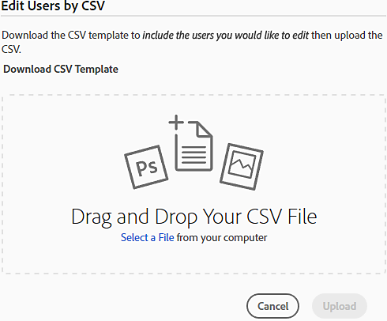

# 既存ユーザーのAdobe Admin Consoleへの移行

エンタープライズおよびチームに適用されます。

このドキュメントは、エンタープライズタームライセンス契約（ETLA）またはバリューインセンティブプラン（VIP）サブスクリプションを通じて、既存のCreative Cloud、Document Cloud、Acrobatのライセンスを持ち、異なる購入プログラムまたはライセンスタイプに移行している企業向けです。

>[!NOTE]
>
>北米にお住まいで、アカウントマネージャーから年間Adobe VIP契約の更新に関するサポートが必要な場合は、**renewalhelp@adobe.com**&#x200B;まで電子メールでお問い合わせください。まもなく連絡いたします。

エンドユーザーの製品アクセスの失効を防ぐには、既存のVIP サブスクリプション期間が終了する前に、Adobe Admin Consoleでライセンスを割り当てます。

* ETLAをご利用のお客様は、少なくとも30日間の製品重複が可能です。 ユーザーがAdobe アプリやサービスにアクセスできるように、契約応当日より前に移行を完了します。 ETLA コントラクトの有効期限の詳細については、[ETLA コントラクトの自動有効期限](https://helpx.adobe.com/enterprise/using/contract-expiry.html)を参照してください。
* VIPをご利用のお客様は、契約応当日までにライセンスを購入し、現在のVIP期間が終了する前にライセンスを割り当てることができます。
* CLPまたはTLPのお客様は、[ ライセンス ](https://helpx.adobe.com/enterprise/using/licensing.html)の移行手順を使用して、シリアル化されたAcrobatまたはCreative Suiteからユーザー指定ライセンスに移行できます。

>[!NOTE]
>
>組織のライセンスの種類が変更された場合、エンドユーザーはAdobeの製品またはサービスからログアウトし、同じ資格情報で再度ログインする必要があります。
>
>Photoshop、Acrobat、Illustratorなどのデスクトップ製品の場合は、ヘルプメニューの「ログアウト」オプションと「ログイン」オプションを使用します。 Adobe.comで、右上隅のアイコンを使用してログアウトし、再度ログインします。

## クイックライセンス割り当て（VIPからVIP）

VIPを通じてCreative Cloud エンタープライズ版またはAcrobat（エンタープライズ版）を購入した現在のVIP メンバーは、更新ウィンドウ中にクイックライセンス割り当てを使用してライセンスを迅速に割り当てることができます。 対象顧客は、次のような基準を満たしています。

* 製品は同じです

   1. 更新ウィンドウが開きます（VIP契約応当日の30日前または後）。
   2. 注文されているエンタープライズ製品は、現在の期間のチームバージョンと同等の新しいSKUです。
   3. エンタープライズライセンスの注文数量が、既存のチームライセンス数量を超えています。

* 製品の価値が向上

   1. 更新ウィンドウが開きます。
   2. 注文されているエンタープライズ製品は、当期のチーム製品よりも価値の高い新しいSKUです。
   3. エンタープライズライセンスの注文数量が、既存のチームライセンス数量を超えています。

* クイックライセンス割り当ては、次の場合に使用できません

   * 注文のエンタープライズライセンスの数が、既存のチームライセンスの数より少なくなっています。
   * 注文は、より価値の高いエンタープライズ製品を対象としていますが、注文されたエンタープライズライセンスの数量は、既存のチームライセンスの数量よりも少なくなっています。
   * 数量に関係なく、チーム製品とエンタープライズ製品が混在します。
   * お客様は、更新期間前に既にチーム製品とエンタープライズ製品を購入しています。
   * エンタープライズ更新SKUは、新しいエンタープライズ注文に使用されます。
   * エンタープライズ製品の注文は、別のVIP契約書番号を対象としています。
   * 現在のチーム製品には、エンタープライズバージョンがないアイテムが含まれます。

Adobeがエンタープライズ版の発注を処理すると、アクセス権を失う前にチームライセンスからAdmin Consoleのエンタープライズライセンスにユーザーを移行する必要がある日など、手順を記載した確認メールが届きます。

Admin Consoleでは、クイックライセンス割り当てを使用してライセンスを割り当てるように求められます。

1. 割り当てるライセンスの数を確認します。

   

2. 割り当て解除されたチーム製品ライセンスが、割り当てられたエンタープライズライセンスと一致することを確認します。

3. プロセスが完了すると、メールが届きます。

   

すべてのライセンスが割り当てられていることを確認するには、Admin Consoleの[結果レポート ](https://helpx.adobe.com/enterprise/using/users.html#main-pars_header_1346350355)をダウンロードしてください。 確認メールの日付より前に完了した場合、エンドユーザーはサービスの失効を経験しないでください。

Adobe オンボーディングスペシャリストとの1:1 オンボーディングコールをスケジュールして、[管理者ロール ](https://helpx.adobe.com/jp/enterprise/using/admin-roles.html)および[ID](https://helpx.adobe.com/jp/enterprise/using/identity.html)など、Admin Consoleの詳細を確認します（まだ行っていない場合）。

>[!NOTE]
>
>クイックライセンス割り当てでは、Team Admin Consoleで保留中の招待状を持つユーザーは移行されません。

## 一括ライセンス割り当て（VIPからVIP）

[!DNL Admin Console]のCSV テンプレートを使用して、一括操作でライセンスを割り当てます。 このアプローチは、次の場合に使用します。

* クイックライセンス割り当て要件を満たさないVIPのお客様、または
* 更新期間外にライセンスを割り当てる必要があります。

1. [Adobe Admin Console](https://adminconsole.adobe.com/enterprise)にアクセスし、ライセンスが追加されたら、**[!UICONTROL Users]** > **[!UICONTROL Users]**&#x200B;に移動します。
2.  ページの右上隅にある&#x200B;**[!UICONTROL 詳細オプションメニュー]**&#x200B;をクリックし、**[!UICONTROL ユーザーの詳細をCSV]**&#x200B;で編集を選択します。
3. **[!UICONTROL ユーザーをCSV]**&#x200B;で編集ダイアログで、**[!UICONTROL CSV テンプレートをダウンロード]**&#x200B;をクリックし、**[!UICONTROL 現在のユーザーリスト]**&#x200B;を選択します。

   

   ダウンロードしたファイルのフィールドの説明については、[CSV ファイル形式](https://helpx.adobe.com/enterprise/using/users.html#main-pars_header)を参照してください。
4. CSVにライセンスの割り当てを追加し、更新されたファイルを&#x200B;**[!UICONTROL CSVでユーザーを編集]** ダイアログにドラッグして、**[!UICONTROL アップロード]**&#x200B;をクリックします。 操作が完了すると、メールが届きます。

   

割り当てを検証するには、[結果レポート ](https://helpx.adobe.com/enterprise/using/users.html#main-pars_header_1346350355)をダウンロードしてください。 次に、Adobe オンボーディングスペシャリストとのオンボーディングをスケジュールして、[管理者の役割](https://helpx.adobe.com/jp/enterprise/using/admin-roles.html)と[ID](https://helpx.adobe.com/jp/enterprise/using/identity.html)について学習します。

## 一括ライセンス割り当て（VIPからETLA）

VIP サブスクリプションを持っていて、ユーザーをETLAに移行する場合は、次の一括フローを使用します。

1. [Adobe Admin Console](https://adminconsole.adobe.com/enterprise)にログインし、VIP ユーザーを含む組織を開きます。
2. **[!UICONTROL Users]** > **[!UICONTROL Users]**&#x200B;に移動します。
3. 右上隅のをクリックし、**[!UICONTROL ユーザーリストをCSV]**&#x200B;に書き出しを選択します。
4. ユーザーが必要なETLA組織を開きます。
5. **[!UICONTROL Users]** > **[!UICONTROL Users]**&#x200B;に移動します。
6. 「**[!UICONTROL ユーザーをCSV]**&#x200B;で追加」をクリックします。
7. 「**[!UICONTROL CSV テンプレートをダウンロード]**」をクリックし、手順3で書き出したCSVからVIP ユーザーを追加します。
8. 更新したCSVをアップロードします。

ETLA組織にユーザーが追加されたときにメールが届きます。

割り当てを検証するには、[結果レポート ](https://helpx.adobe.com/enterprise/using/users.html#main-pars_header_1346350355)をダウンロードしてください。 Adobe オンボーディングスペシャリストとのオンボーディングをスケジュールして、[管理者の役割](https://helpx.adobe.com/jp/enterprise/using/admin-roles.html)および[ID](https://helpx.adobe.com/jp/enterprise/using/identity.html)を担当します。

一括アップロードの問題については、[ ユーザーの一括アップロードのトラブルシューティング ](https://helpx.adobe.com/enterprise/kb/troubleshoot-bulk-user-csv-upload.html)を参照してください。

## 一括ライセンス割り当て（ETLAからVIP）

ETLA サブスクリプションを所有しており、ユーザーをVIPに移行している場合：

1. [Adobe Admin Console](https://adminconsole.adobe.com/enterprise)にログインし、ETLA ユーザーを含む組織を開きます。
2. **[!UICONTROL Users]** > **[!UICONTROL Users]**&#x200B;に移動します。
3. 右上隅のをクリックし、**[!UICONTROL ユーザーリストをCSV]**&#x200B;に書き出しを選択します。

   

4. ユーザーが必要なVIP組織を開きます。
5. **[!UICONTROL Users]** > **[!UICONTROL Users]**&#x200B;に移動します。
6. 「**[!UICONTROL ユーザーをCSV]**&#x200B;で追加」をクリックします。
7. 「**[!UICONTROL CSV テンプレートをダウンロード]**」をクリックし、手順3で書き出したCSVからETLA ユーザーを追加します。
8. 更新したCSVをアップロードします。

VIP組織にユーザーが追加されたときにメールが届きます。

割り当てを検証するには、[結果レポート ](https://helpx.adobe.com/enterprise/using/users.html#main-pars_header_1346350355)をダウンロードしてください。 Adobe オンボーディングスペシャリストとのオンボーディングをスケジュールして、[管理者の役割](https://helpx.adobe.com/jp/enterprise/using/admin-roles.html)および[ID](https://helpx.adobe.com/jp/enterprise/using/identity.html)を担当します。

一括アップロードの問題については、[ ユーザーの一括アップロードのトラブルシューティング ](https://helpx.adobe.com/enterprise/kb/troubleshoot-bulk-user-csv-upload.html)を参照してください。

