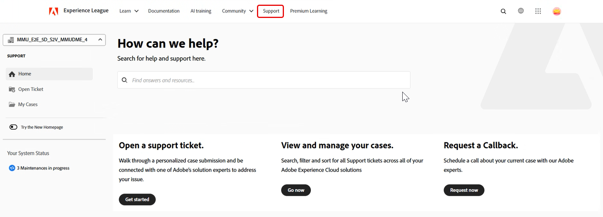
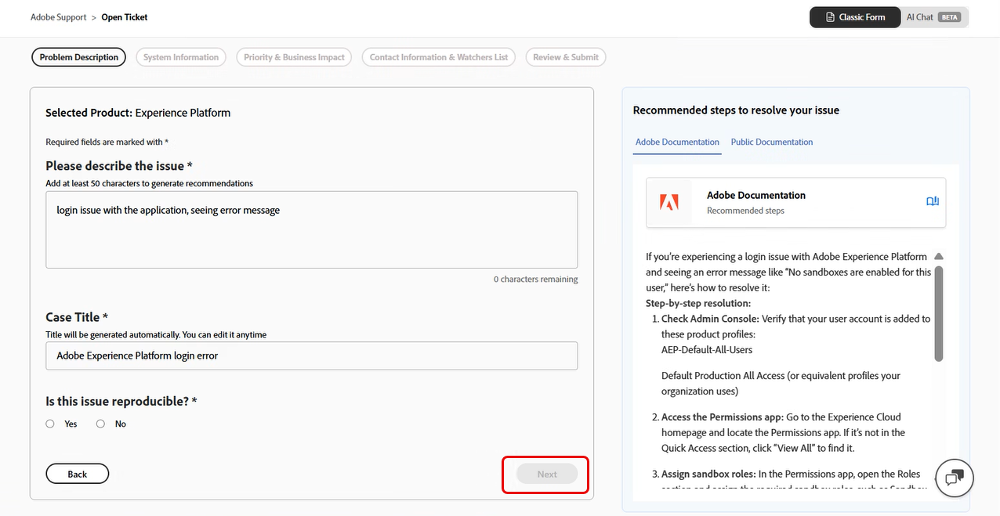
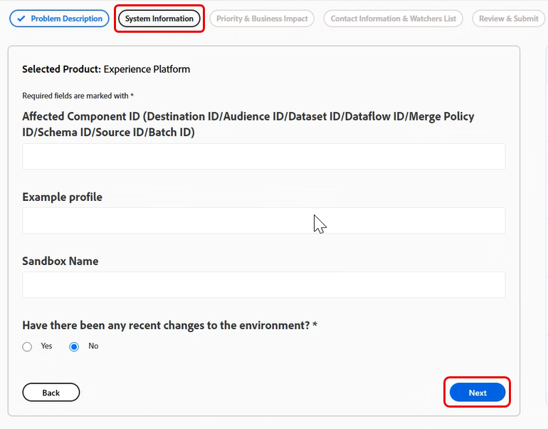

# Adobe カスタマーサポート体験

## Experience League サポートチケット

サポートチケットは[Experience League](https://experienceleague.adobe.com/home#support)経由で送信されるようになりました。 サポートチケットの送信方法については、「[&#x200B; サポートチケットの送信](#create-a-support-ticket-with-experience-league)」の節を参照してください。

Adobe カスタマーサポートとのやり取りを改善できるように取り組んでいます。 「当社のビジョンは、Experience Leagueを利用して、単一のエントリーポイントに移行することで、サポート体験を合理化することです。 本番稼働後は、Adobeカスタマーサポートに簡単にアクセスできるようになり、製品間の共通システムを通じてサービス履歴をより詳細に把握できます。また、単一のポータルを通じて、電話、web、チャットでサポートを受けることができます。

Adobe Commerce ユーザーの場合は、Adobe CommerceのExperience League サポートユーザーガイドの[&#x200B; サポートケースの送信](https://experienceleague.adobe.com/en/docs/commerce-knowledge-base/kb/help-center-guide/magento-help-center-user-guide#support-case)を参照してください。

## ケース提出に必要な権限のある役割のサポート {#submit-ticket}

[Experience League](https://experienceleague.adobe.com/home#support)でサポートチケットを送信するには、システム管理者がサポート管理者の役割を割り当てる必要があります。 この役割を割り当てることができるのは、組織内のシステム管理者のみです。 製品、製品プロファイル、およびその他の管理者役割は、サポート管理者の役割を割り当てることができず、サポートチケットの送信に使用される「**[!UICONTROL ケースを作成]**」オプションを表示できません。 管理者ロールの種類とその使用権限について詳しくは、[管理者ロール &#x200B;](admin-roles.md)を参照してください。

Commerceを使用している場合、サポートケースで作業するアクセスを共有するプロセスは異なります。 詳しくは、Adobe CommerceのExperience League サポートユーザーガイドの「[共有アクセス：他のユーザーがアカウントにアクセスするための権限を付与する](https://experienceleague.adobe.com/en/docs/commerce-knowledge-base/kb/help-center-guide/magento-help-center-user-guide#shared-access)」を参照してください。

### サポート資格の役割を組織に追加する

サポート管理者の役割は、サポートに関連する情報にアクセスできる管理者以外の役割です。 サポート管理者は、イシューレポートを表示、作成、管理できます。

管理者を追加または招待するには：

1. Admin Consoleで、**[!UICONTROL Users]** > **[!UICONTROL Administrators]**&#x200B;を選択します。
1. 「**[!UICONTROL 管理者を追加]**」をクリックします。
1. 名前または電子メールアドレスを入力します。

   有効なメールアドレスを指定し、画面に情報を入力することで、既存のユーザーを検索したり、新しいユーザーを追加したりできます。

   

1. 「**[!UICONTROL 次へ]**」をクリックします。 管理者の役割のリストが表示されます。

サポート管理者の役割をユーザーに割り当てるには（ユーザーがサポートに問い合わせできるようにする）:

1. 「**[!UICONTROL サポート管理者]**」オプションを選択します。

   

1. 次の2つのオプションのいずれかを選択します。

   * オプション 1: **[!UICONTROL 基本サポート管理者]**。 すべてのソリューション（Marketo Engageを除く）に対するユーザーサポートへのアクセス権を付与する場合は、このオプションを選択します。
   * オプション 2: **[!UICONTROL 製品サポート管理者]**: Marketo Engage サポートにこのオプションを選択します。 ユーザーサポートへのアクセス権を付与するMarketo Engage インスタンスを選択します。

   

1. 選択したら、**[!UICONTROL 保存]**&#x200B;をクリックします。

ユーザーは、新しい管理者権限に関する招待メールを`message@adobe.com`から受け取ります。

ユーザーが組織に参加するには、メール内の&#x200B;**開始**&#x200B;をクリックする必要があります。 新しい管理者が電子メールの招待状に「**はじめに**」リンクを使用しない場合、Admin Consoleにサインインできません。

サインインプロセスの一環として、Adobe プロファイルを既にお持ちでない場合は、設定するように求められる場合があります。 ユーザーがメールアドレスに複数のプロファイルを関連付けている場合、ユーザーは&#x200B;**チームに参加** （プロンプトが表示された場合）を選択し、新しい組織に関連付けられているプロファイルを選択する必要があります。

詳細については、管理者ロールのドキュメントの「[&#x200B; エンタープライズ管理者ロールを編集](admin-roles.md#add-enterprise-role)」の手順に従ってください。 この役割を割り当てることができるのは、組織のシステム管理者のみです。 管理階層について詳しくは、[管理ロール &#x200B;](admin-roles.md)のドキュメントを参照してください。

### Experience Leagueでサポートチケットを作成する

>[!NOTE]
>
> サポートチケットを送信する前に、[Adobe ステータス &#x200B;](https://status.adobe.com/ja) サイトでAdobe システムのパフォーマンス、可用性、既知の問題を確認してください。

Experience Leagueは、資格を持つお客様にパーソナライズされたサポートと使いやすいエクスペリエンスを提供するために設計されたセルフサービスポータルです。

1. [Experience League](https://experienceleague.adobe.com/home#support)でチケットを作成するには、上部のナビゲーションで「**[!UICONTROL サポート]**」タブを選択します。

   

1. **[!UICONTROL ホーム]** メニューから、**[!UICONTROL サポートチケットを開く]**、**[!UICONTROL ケースを表示して管理する]**、**[!UICONTROL コールバックをリクエストする]**、または追加の学習リソースにアクセスできます。

   「**[!UICONTROL コールバックをリクエスト]**」オプションを使用すると、画面共有を使用してweb ミーティングをスケジュールでき、より迅速かつ効率的な問題解決が可能になります。 Adobe Experience Manager、Campaign、Workfrontで使用できます。 顧客の都合に合わせてミーティングをスケジュールしたり、インスタント招待状を提供したりすることができます。 Adobe Experience Manager P1の場合、重要な問題発生時に迅速なエンゲージメントを可能にするため、すぐにコールバックをおこない、ダウンタイムとビジネスへの影響を最小限に抑えることができます。

   

1. ケースを送信するには、**[!UICONTROL サポートチケットを開く]**&#x200B;を選択します。 サイドバーメニューで「**[!UICONTROL チケットを開く]**」を選択することもできます。

   

### サポートチケットへの記入

「**[!UICONTROL サポートチケットを開く]**」または「**[!UICONTROL チケットを開く]**」を選択すると、ケース作成フォームが表示されます。

このフォームでは、Adobe サポートが問題を効率的にトラブルシューティングするために必要な情報を提供するのに役立つ、ガイド付きのマルチステップのワークフローを使用します。 次のセクションを使用して、フォーム内を移動できます。

* 製品の選定
* 問題の説明
* 優先度とビジネスインパクト
* 連絡先情報と監視リスト
* レビューして送信

ケースを送信する前に、セクション **を**&#x200B;切り替えて情報を更新することもできます。

サポートチケットを作成するには、次の手順に従います。

1. 製品名をクリックして影響を受ける製品を選択し、**[!UICONTROL 次へ]**&#x200B;をクリックします。

   

1. 「**[!UICONTROL 問題の説明]**」セクションに、問題の説明を入力します。 問題の説明に基づいて、ケースタイトルが自動的に生成されます。 必要に応じてタイトルを編集できます。 問題を再現できるかどうかを確認します。 問題が再現可能な場合は、**はい**&#x200B;を選択します。 問題を再現するために必要な手順を説明できるテキストボックスが表示されます。 問題を一貫して再現できない場合は、**No**&#x200B;を選択します。

   

   次のような詳細を含めます。

   * 目標の達成
   * 何が期待通りに機能しないか
   * 既に実行した手順
   * 問題が再現可能かどうか

   問題の説明を入力すると、Experience LeagueはAIを活用したレコメンデーションをフォームの横のパネルに表示します。 推奨事項：

   * 関連文書や既知の解決策を提案
   * 問題が既に解決されているかどうかを確認するのに役立ちます
   * 一般的な問題に対してケースを提出する必要性を減らしたい

   パネルは、ケース作成プロセスを中断することなく表示されます。 レコメンデーションはいつでも確認でき、必要に応じてケースを送信し続けることができます。

   >[!NOTE]
   >
   >レコメンデーションを生成するには、**問題の説明に50文字以上を含める必要があります**。 リアルタイムの文字カウンターは、最小要件を追跡するのに役立ちます。

   

1. 「**[!UICONTROL 次へ]**」をクリックします。

   

1. **[!UICONTROL システム情報]** セクションで、**[!UICONTROL 製品バージョン]**、**[!UICONTROL 環境]**、**[!UICONTROL 製品オファー]**&#x200B;を指定し、環境またはインスタンスに最近変更が加えられたかどうかを示します。 **はい**&#x200B;を選択して、変更に関する詳細を追加します。 変更が行われなかった場合は、**No**&#x200B;を選択し、**[!UICONTROL 次へ]**&#x200B;をクリックします。

   >[!NOTE]
   >
   > 選択した製品に基づいて、追加のフィールドが表示されます。 これらのフィールドには、問題が発生する環境に関する詳細が含まれます。

   

1. 「**[!UICONTROL 優先度とビジネスへの影響]**」セクションで、次の項目を選択します。
   * ケースの優先度（P4 - マイナー、P3 – 重要、P2 - Urgent、P1 - Critical）
   * 選択した優先度がP1 - Criticalの場合にビジネス影響の詳細を指定し、**[!UICONTROL Next]**&#x200B;をクリックします。

   

   ケースの優先度とビジネスへの影響がサポート応答時間にどのような影響を与えるかについて詳しくは、サクセスプランのリソースドキュメントの「[&#x200B; サポートの目標初期応答時間](https://experienceleague.adobe.com/en/docs/support-resources/data-sheets/overview#targeted-initial-response-times-for-support)」を参照してください。

1. **[!UICONTROL 連絡先情報と視聴者リスト]** セクションで、タイムゾーンを選択し、電話番号を入力し、視聴者を追加し、必要に応じてファイルを添付してから、**[!UICONTROL 次へ]**&#x200B;をクリックします。

   

1. **[!UICONTROL レビューと送信]** セクションで、ケースの詳細を確認し、**[!UICONTROL ケースの承認と送信]**&#x200B;をクリックします。

   

   **[!UICONTROL レビューと送信]**&#x200B;の手順では、入力したすべての情報を要約し、次のことを実行できます。

   * すべてのケースの詳細を1か所で確認する
   * 前の手順に戻って編集します
   * 進捗を見失うことなくレビュー概要に戻る

送信後：

* ケースはExperience Leagueに記録されます
* 更新を追跡し、ポータルを通じてサポートに連絡できます
* Adobe サポートは、提供された優先度と影響に基づいて対応します

>[!TIP]
>
> 「**[!UICONTROL チケットを開く]**」オプションまたは「**[!UICONTROL サポート]**」タブが表示されない場合は、システム管理者に連絡してサポート管理者の役割を割り当ててください。

>[!NOTE]
>
> 問題が原因で本番システムが停止したり、重大な障害が発生した場合は、すぐにサポートを受けるために電話番号が提供されます。
