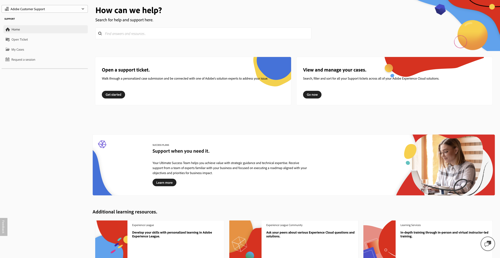
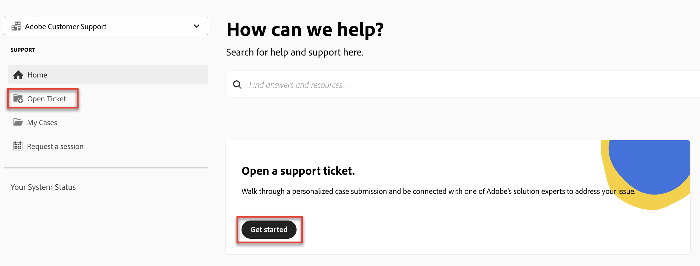
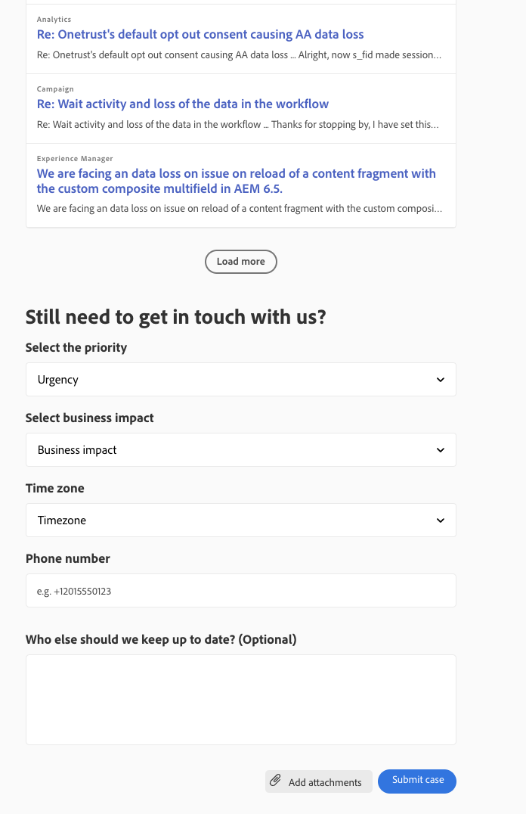

# Adobe カスタマーサポート体験

この記事では、Experience Leagueを使用してサポートチケットを送信し、ケースに関連するアクセスを管理する方法について説明します。

## Experience League サポートチケット

サポートチケットは[Experience League](https://experienceleague.adobe.com/home#support)経由で送信されるようになりました。 サポートチケットの送信方法については、「[ サポートチケットの送信](#create-a-support-ticket-with-experience-league)」の節を参照してください。

Adobe カスタマーサポートとのやり取りを改善できるように取り組んでいます。 「当社のビジョンは、Experience Leagueを利用して、単一のエントリーポイントに移行することで、サポート体験を合理化することです。 本番稼働後は、Adobeカスタマーサポートに簡単にアクセスできるようになり、製品間の共通システムを通じてサービス履歴をより詳細に把握できます。また、単一のポータルを通じて、電話、web、チャットでサポートを受けることができます。

Adobe Commerce ユーザーの場合は、Adobe CommerceのExperience League サポートユーザーガイドの[ サポートケースの送信](https://experienceleague.adobe.com/en/docs/commerce-knowledge-base/kb/help-center-guide/magento-help-center-user-guide#support-case)を参照してください。

## ケース提出に必要な権限のある役割のサポート {#submit-ticket}

[Experience League](https://experienceleague.adobe.com/home#support)でサポートチケットを送信するには、システム管理者がサポート管理者の役割を割り当てる必要があります。 この役割を割り当てることができるのは、組織内のシステム管理者のみです。 製品、製品プロファイル、およびその他の管理者役割は、サポート管理者の役割を割り当てることができず、サポートチケットの送信に使用される「**[!UICONTROL ケースを作成]**」オプションを表示できません。 管理者ロールの種類とその使用権限について詳しくは、[管理者ロール ](admin-roles.md)を参照してください。 ケースを送信する前にこれらのサポート使用権限を設定する必要がある場合は、[Adobe カスタマーサポート使用権限の設定](adobe-customer-support-entitlement-configuration.md)を参照してください。

Commerceを使用している場合、サポートケースで作業するアクセスを共有するプロセスは異なります。 詳しくは、Adobe CommerceのExperience League サポートユーザーガイドの「[共有アクセス：他のユーザーがアカウントにアクセスするための権限を付与する](https://experienceleague.adobe.com/en/docs/commerce-knowledge-base/kb/help-center-guide/magento-help-center-user-guide#shared-access)」を参照してください。

### Experience Leagueでサポートチケットを作成する

>[!NOTE]
>
> サポートチケットを送信する前に、[Adobe ステータス ](https://status.adobe.com/ja) サイトでAdobe システムのパフォーマンス、可用性、およびソリューションの問題を確認することを検討してください。

サポートケースを提出するプロセスは、Experience League サポートプラットフォームと直接統合されました。 これは、権限を持つ顧客により多くのパーソナライゼーションと使いやすさを提供するために、最近再設計されたセルフサービスポータルです。

1. [Experience League](https://experienceleague.adobe.com/home#support)を使用してチケットを作成するには、上部のナビゲーションにある「**[!UICONTROL サポート]**」タブを選択します。
   
1. サポートホームページから、開いているサポートケースに簡単に移動したり、新しいケースをログに記録したり、トップのサポート記事を表示したり、その他の学習ソースにアクセスしたりすることができます。
   
1. ケースを送信するには、**[!UICONTROL サポートチケットを開く]**&#x200B;を選択します。 サイドバーメニューの「**[!UICONTROL チケットを開く]**」オプションも選択します。

### サポートチケットの記入

1. 「**[!UICONTROL サポートチケットを開く]**」を選択すると、ケース作成ページに移動します。このページでは、製品名（Audience Manager、Campaign、Targetなど）、**[!UICONTROL ケースタイトル]**、**[!UICONTROL ケースの説明]**&#x200B;を入力できます。

   

   トラブルシューティング プロセスを迅速化するには、**[!UICONTROL ケースの説明]** フィールドに次の情報を追加します。

   * 問題の明確化
   * 複製の手順
   * ビジネスインパクト記述書
   * これは新しい実装/機能/開発ですか？
   * そのプロセスはいつ機能しましたか？
   * トラブルシューティング手順
   * 関連ログデータ
   * バージョン番号
   * ビルド情報（該当する場合）
   * クリティカル ID

1. 任意のソリューションを選択する際に、次の質問が表示されます。一部のソリューションには追加フィールドがあります。

   * ケースの優先度（低、Medium、高、クリティカル）
   * ビジネスインパクト
   * 顧客タイムゾーン（アメリカ大陸、EMEA、アジア太平洋）

   ケースの優先度とビジネスへの影響がサポートの応答時間にどのような影響を与えるかについて詳しくは、サクセスプランのリソースドキュメントの「[ サポートの目標初期応答時間](https://experienceleague.adobe.com/en/docs/support-resources/data-sheets/overview#targeted-initial-response-times-for-support)」を参照してください。

>[!TIP]
>
> 「**[!UICONTROL ケースを作成]**」オプションまたは「**[!UICONTROL サポート]**」タブが表示されない場合は、システム管理者に連絡してサポート管理者の役割を割り当てる必要があります。

>[!NOTE]
>
> 問題が原因で本番システムが停止したり、重大な中断が発生した場合は、すぐにサポートを受けるために電話番号が提供されます。

