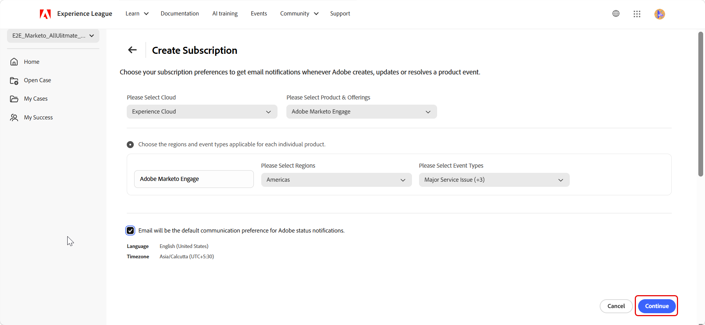
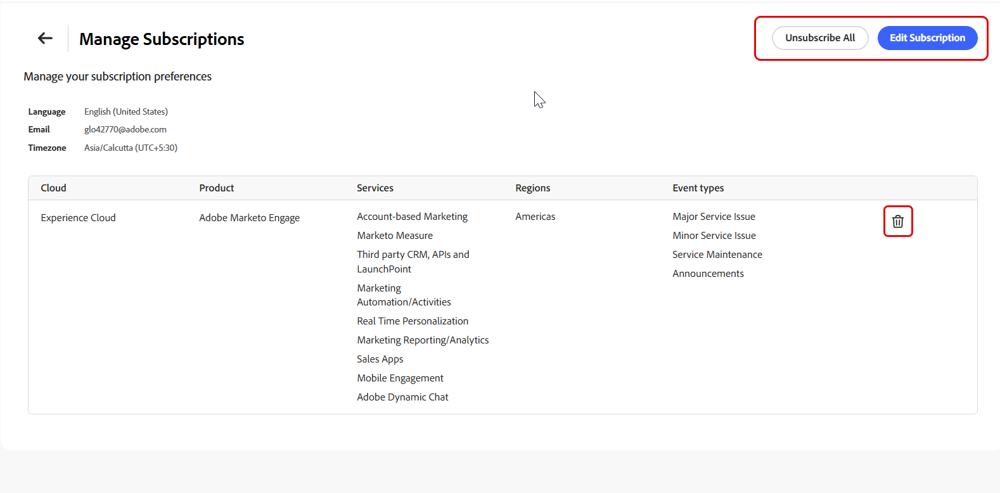

# Experience League サポートポータル – 新しいユーザーインターフェイス

## 概要

再設計されたExperience League サポートポータルでは、Adobe サポートアクティビティを管理するための統一された直感的なエクスペリエンスを提供します。 サポートケースの追跡、製品ステータスの監視、ケースインサイトへのアクセス、サクセスチームとの連携など、重要な機能にすばやくアクセスできます。

>[!NOTE]
>
>再設計されたポータルでサポートケースを作成および管理するには、[ サポートケースの作成と管理](exl-new-ui-support-cases.md)を参照してください。

## ホームページ

**[!UICONTROL ホーム]** ページは、サポート活動の中心的なハブとして機能します。 サポート環境の概要と主な機能への迅速なアクセスを提供します。

左側のナビゲーションパネルでは、次のセクションにアクセスできます。

- **[!UICONTROL ホーム]**&#x200B;がデフォルトのランディングページとして開き、サポートアクティビティの一元的なビューが表示されます。
- **[!UICONTROL ケースを開く]**&#x200B;は、再設計されたポータルでケース作成ワークフローを開きます。 [ サポートケースの作成と管理](exl-new-ui-support-cases.md)を参照してください。
- **[!UICONTROL マイケース]**&#x200B;は、再設計されたポータルでケースリストを開きます。 [ サポートケースの作成と管理](exl-new-ui-support-cases.md)を参照してください。
- **[!UICONTROL My Success]**&#x200B;は、Ultimate Success plan ユーザーのみが利用できます。

## 組織の切り替え

複数の組織に関連付けられている場合は、ポータルの左上隅にある&#x200B;**組織スイッチャー**&#x200B;を使用します。

組織を切り替えると、選択した組織を反映するために、ポータル全体でケースデータ、製品ステータス、サポート情報が更新されます。

## ポータル間の切り替え

ポータルのトグルを使用して、再設計されたExperience League サポートポータルと現在のポータルを切り替えます。

両方のポータルは同期されたままであり、ケースデータとサポート情報がエクスペリエンスをまたいで一貫性を保つようにします。

ホームページには、Experience League サポートポータル全体での検索を可能にするグローバル検索バーを備えたパーソナライズされたウェルカムバナーが含まれています。

次のクイックアクションは、**[!UICONTROL ホーム]** ページの上部で使用できます。

1. **[!UICONTROL サポートケースを開く]** – 再設計されたポータルでケース作成ワークフローを開きます。 「**[!UICONTROL 基本を学ぶ]**」を選択します。

1. **[!UICONTROL ケースを表示して管理]** – 再設計されたポータルで&#x200B;**[!UICONTROL マイケース]** ページを開きます。 **[!UICONTROL 今すぐ実行]**&#x200B;を選択します。

1. **[!UICONTROL コールバックをリクエスト]** - Adobeの専門家とのケースに関する通話をスケジュールします。 P1 （クリティカル）ケースの場合は、直ちにコールバックをリクエストします。 P2およびP3の場合は、都合の良い日時にサポートエンジニアとのweb ミーティングをスケジュールします。 **[!UICONTROL 今すぐリクエスト]**&#x200B;を選択して開始してください。

## Service Analytics

「**[!UICONTROL サービス分析]**」セクションには、サポートケースのアクティビティの概要が表示されます。 ビューセレクターを使用して、**[!UICONTROL My Cases]**&#x200B;と&#x200B;**[!UICONTROL My Org Cases]**&#x200B;を切り替えます。

- **[!UICONTROL マイケース]** – 個人に固有のケース統計を表示します。
- **[!UICONTROL My Org Cases]** – 選択した組織のケース統計を表示します。

選択したビューは、このセクションのすべての指標とグラフに適用されます。これには、[[!UICONTROL 優先度によるケース数]](#cases-count-by-priority)および[[!UICONTROL 自分が送信したケース ]](#my-submitted-cases)のセクションが含まれます。

**[!UICONTROL Service Analytics]** セクションには、次の指標が用意されています。

- **[!UICONTROL 保留中の応答ケース]** – 応答を待っているケースの数を表示します。
- **[!UICONTROL 送信済みケース]** – 送信されたケースの合計数を表示します。

## 優先度別のケース数

このセクションでは、サポートケースの優先度レベル別の視覚的な内訳を表示します。

**[!UICONTROL サービス分析]** セクションの&#x200B;**[!UICONTROL マイケース]**&#x200B;と&#x200B;**[!UICONTROL マイオーガニケース]**&#x200B;の選択がこのグラフに適用され、個人レベルまたは組織レベルでの表示が可能になります。

優先度セグメントにカーソルを合わせると、次のようなツールヒントが表示されます。

- その優先度レベルのケースの合計数
- オープン ケースの数
- クローズされたケースの数

## 自分が送信したケース

このセクションには、次の3つの最新のサポートケースが表示されます。

- ケース ID
- ケースのタイトル
- 優先度
- 送信日
- ステータス

**[!UICONTROL Service Analytics]**&#x200B;で&#x200B;**[!UICONTROL マイケース]**&#x200B;が選択されている場合、このセクションには、最近送信された3つのケースが表示されます。 **[!UICONTROL サービス分析]** セクションで&#x200B;**[!UICONTROL 組織ケース]**&#x200B;が選択されると、組織全体で最近送信された3つのケースが表示されます。

**[!UICONTROL ケース ID]**&#x200B;を選択して、再設計されたExperience League サポートポータルでケースの詳細を表示します。

「**[!UICONTROL すべてのケースを表示]**」を選択して、再設計されたExperience League サポートポータルで&#x200B;**[!UICONTROL マイケース]** ページを開きます。

**[!UICONTROL Service Analytics]**&#x200B;で&#x200B;**[!UICONTROL マイケース]**&#x200B;が選択されると、**[!UICONTROL マイケース（すべて）]**&#x200B;が事前に選択され、Experience League サポートポータルで開きます。 **[!UICONTROL 組織のケース]**&#x200B;が選択されると、**[!UICONTROL 組織のケース （すべて）]**&#x200B;がExperience League サポートポータルで事前に選択されます。

## 製品ステータスアラート

このセクションには、組織に割り当てられたAdobe製品の現在の運用状況が表示されます。

**[!UICONTROL Available]**&#x200B;というステータスは、製品が完全に動作しており、アクティブな停止がないことを示します。 1つ以上の問題が存在する場合、アクティブな問題の合計数が製品カードに表示されます。

製品は次の順序で表示されます。

1. アクティブな問題を含む製品
1. 残りの製品（アルファベット順）

これにより、注意が必要な製品を迅速に特定し、優先順位を付けることができます。 1つ以上の製品カードを選択して、**[!UICONTROL ホーム]** ページの&#x200B;**[!UICONTROL システムステータスアラート]**&#x200B;のアラートをフィルタリングできます。

## システムステータスアラート

このセクションには、Adobe商品に関するリアルタイムのアラートが表示されます。 次のタブを使用して、イベントタイプ別にアラートをフィルタリングできます。

- メジャー
- 軽微
- 潜在顧客
- メンテナンス
- 発表

各アラートには次のものが含まれます。

- イシュー番号
- クラウド
- 領域
- ステータス
- 参照用の開始時間と終了時間

追加の詳細を表示するアラートを選択します。

### 購読の管理

**[UICONTROL Manage Subscriptions]**&#x200B;を使用して、Adobeの製品およびサービスのステータス イベントに関するメール通知を設定します。 サブスクリプションを使用すると、選択した製品や地域のイベントをAdobeが作成、更新、解決する際に、情報を常に把握できます。

1. 「**[!UICONTROL システムステータスアラート]**」セクションで、**[!UICONTROL サブスクリプションの管理]**&#x200B;を選択します。

   

1. **[!UICONTROL 購読の管理]** ページで、**[!UICONTROL 購読の作成]**&#x200B;を選択します。

   

1. **[!UICONTROL クラウドを選択してください]**&#x200B;で、モニターする商品を含むAdobe クラウドを選択します。
1. 「**[!UICONTROL 製品とサービスを選択してください]**」で、通知を受け取る製品を選択します。
1. **[!UICONTROL 地域を選択してください]**&#x200B;で、監視する1つ以上の地域を選択してください。
1. **[!UICONTROL イベントタイプを選択してください]**。次の1つ以上のイベントタイプを選択してください。

   * サービスに関する大きな問題
   * マイナーサービスの問題
   * サービスメンテナンス
   * 発表

   

1. 言語やタイムゾーンなどのデフォルトの通知設定を確認します。
1. **[!UICONTROL 続行]**&#x200B;を選択します。
1. 選択したクラウド、製品、サービス、地域、イベントタイプなど、サブスクリプションの詳細を確認します。
1. サブスクリプションを作成するには、**[!UICONTROL 確認]**&#x200B;を選択します。

   

1. 確認メッセージが表示され、サブスクリプションが作成されます。

サブスクリプションを作成した後、選択した製品、地域、イベントタイプの条件に一致するイベントが作成、更新、または解決されると、Adobeはメール通知を送信します。

>[!NOTE]
>
>メールは、ステータス通知のデフォルトのコミュニケーションチャネルです。 サブスクリプションの環境設定は、選択した製品、地域、およびイベントタイプにのみ適用されます。

次回&#x200B;**[!UICONTROL サブスクリプションの管理]**&#x200B;を開くと、選択したクラウド、製品、サービス、地域、イベントタイプなど、現在のサブスクリプションの詳細がページに表示されます。

このページから、次のアクションを実行できます。

* **[!UICONTROL サブスクリプションを編集]**&#x200B;を選択して、既存のサブスクリプションを変更します。
* 「**[!UICONTROL すべて購読解除]**」を選択してすべての購読を削除します。
* サブスクリプションの横にある削除アイコンを選択して、個々のサブスクリプションを削除します。

## プラン情報

このセクションでは、サポートプラン（Ultimate Success planおよびExpert Success plan）に関する主な詳細情報と、利用可能なメリットについて説明します。 「**[!UICONTROL 詳細情報]**」を選択して、プランの全範囲を確認します。

## マイ サクセス

**[!UICONTROL My Success]** ページでは、Adobeとのエンゲージメントのパーソナライズされたビューを提供します。 サクセスチーム、プログラムの利点、学習リソースに直接アクセスできます。

>[!NOTE]
>  
>このページは、**[!UICONTROL Ultimate Success]** プランのお客様のみが利用できます。

このページには、次の情報が含まれます。

- Adobe Ultimate Successが、どのように戦略的なリーダーシップと先見的なテクニカルヘルスサポートを提供して、高パフォーマンスのデジタル体験を提供するかを示すウェルカムメッセージです
- **[!UICONTROL ビデオを見る]** オプションで、プランの詳細を確認できます
- この計画の主要な構成要素は次のとおりです。
  - **[!UICONTROL 成功チーム]**
  - **[!UICONTROL サクセスアクセラレータ]**
  - **[!UICONTROL Mutual Action Plan]**

また、Experience League、Experience League Community、Premium Learning Subscriptionsなどの学習リソースにもアクセスできます。

### Adobe Success Team

このセクションには、Adobe Success専任チームが表示されます。 チームメンバーの横にある&#x200B;**[!UICONTROL 連絡先]**&#x200B;を選択して、メールを送信します。

