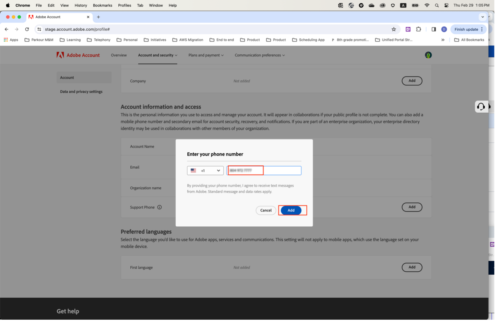

# 希望するサポート電話番号を指定してください

**製品サポート管理者**&#x200B;など、**管理者**&#x200B;の役割が割り当てられていると、インスタンスを管理するための管理者権限があることを確認する電子メールが届きます。

メールには、次の赤いテキストが含まれるようになりました。このテキストでは、**[!UICONTROL アカウントプロファイル]**&#x200B;にアクセスし、お好みのサポート電話番号をアドビと共有する方法を説明しています。

希望する電話番号を指定するには：

1. 「**[!UICONTROL アカウントプロファイル]**」リンクをクリックして、新しいウィンドウを開き、`account.adobe.com`を使用してログインします。

   

1. ログインプロセスを実行し、`account.adobe.com`の次の画面に移動します。
1. 「**[!UICONTROL アカウントとセキュリティ]** > **[!UICONTROL アカウント]**」を選択すると、「サポート電話番号」フィールドが表示されます。
1. サポートニーズを認識するために使用したい電話番号をここに追加してください。

