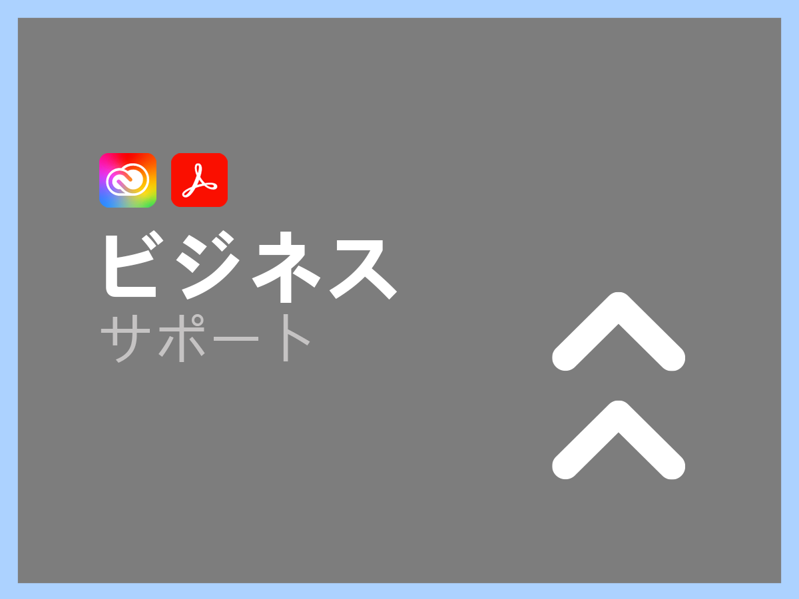

# Creative Cloud エンタープライズ版および Document Cloud のサポートサービス

Adobe Creative Cloud と Document Cloud のカスタマーサポート組織は、お客様の成功のために尽力しています。すべてのアプリケーションには、技術支援のための高度なスキルを持つ技術リソースへの簡単なアクセスを提供するサポートが含まれています。

より包括的なニーズに対応するために、指定されたサポート専門家へのアクセスや、プロアクティブなメンタリングおよびサービスレビューのためのセッションなど、様々なアドビサポートサービスを提供しています。お客様のサポートニーズがどれほど複雑であっても、アドビは、お客様がアドビアプリケーションから最高のパフォーマンスと最適な価値を得るために必要な技術的および運用上の専門知識を提供します。

<table style="table-layout:fixed">
<tr>
  <td>
    
    

    <a href="dme-standard.md"><strong>標準サポート</strong></a>（<a href="assets/DMeStandardSupportDatasheet_2022.pdf" target="_blank">PDF</a> を表示）
    

    
認定ユーザー（管理者）向けのチャットや電話によるテクニカルサポートチームへの 24 時間アクセスおよびサポート web ポータルを通じたサポートリクエストをログに記録する機能。 

     
  </td>
  <td>
    
    

    <a href="dme-business.md"><strong>ビジネスサポート</strong></a>（<a href="assets/DMeBusinessSupportDatasheet_2022.pdf" target="_blank">PDF</a> を表示）
    

    
より高度なサポートへのより迅速な接続と、アカウントサポートリードを活用して最も重要なサポートリクエストの定期的な連絡と更新を受信する機能を確保するためのサポートケースの優先ルーティング。

     
  </td>
</tr>
<tr>
  <td>
    
    

    <a href="dme-enterprise.md"><strong>エンタープライズサポート</strong></a>（<a href="assets/DMeEnterpriseSupportDatasheet_2022.pdf" target="_blank">PDF</a> を表示）
    

    
お客様のソリューションに深い経験を持つアドビサポートチームの指定技術担当者が、お客様およびお客様の技術チームと連携して、確実にすべてのサポートリクエストをタイムリーに解決します。

     
  </td>
  <td>
    
    

    <a href="dme-elite.md"><strong>エリートサポート</strong></a>（<a href="assets/DMeEliteSupportDatasheet_2022.pdf" target="_blank">PDF</a> を表示）
    

    
アドビサポートチームの指定された技術担当者と、お客様と協力してクラス最高のプロアクティブなサポートを提供し、投資を最大限に活用し、問題を発生前に回避できるようにするテクニカルアカウントマネージャー。

     
  </td>
</tr>
</table>

