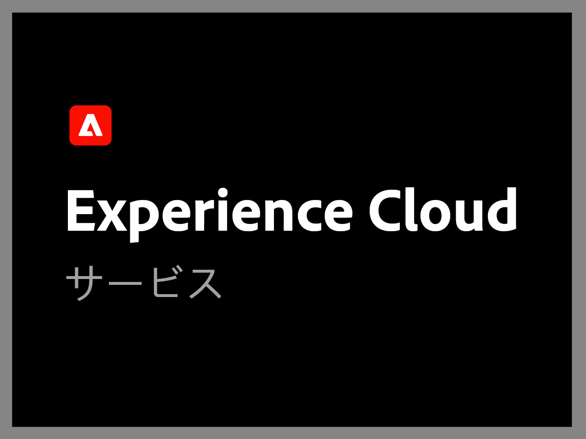
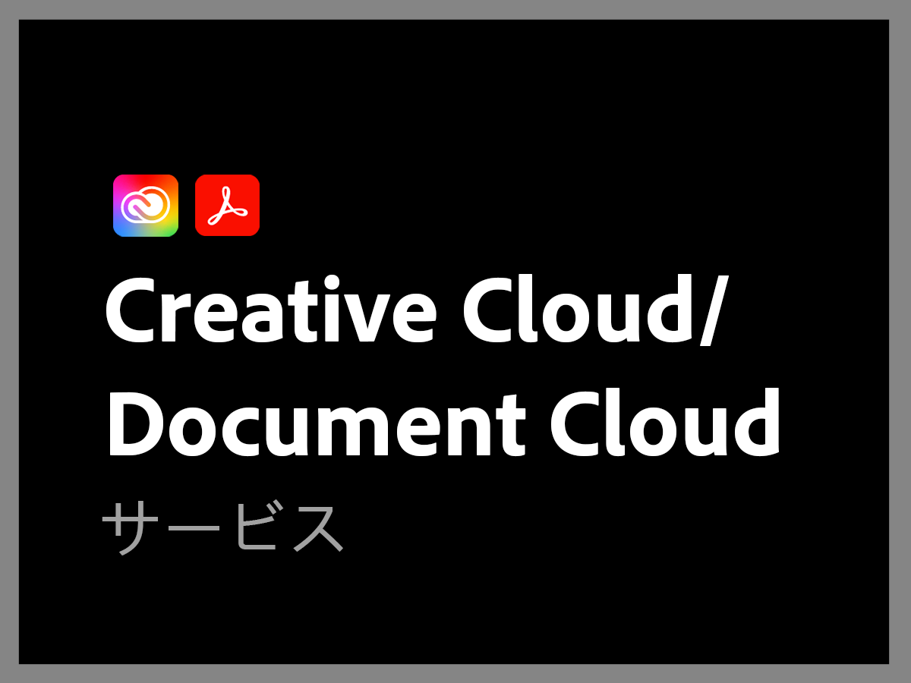

# 事前Adobe支援計画の概要

>[!NOTE]
>
>このプランは、2022 年 6 月 16 日 (PT) より前のAdobeサポートプランを対象としています。 現在のサポート計画については、 [Adobeサポート製品の概要](overview.md).

アドビサポート組織は、お客様の成功のために尽力しています。どのサブスクリプションを選択しても、高度なスキルを持つアドビのテクニカルリソースに簡単にアクセスして技術支援を受けることができます。

より包括的なニーズに対応するために、指定されたサポート専門家へのアクセスや、プロアクティブなメンタリングおよびサービスレビューのためのセッションなど、様々なアドビサポートサービスを提供しています。お客様のサポートニーズがどれほど複雑であっても、アドビは、お客様がアドビソリューションから最高のパフォーマンスと最適な価値を得るために必要な技術的および運用上の専門知識を提供します。

<table style="table-layout:fixed">
<tr>
  <td>
    
    

    <a href="dx-overview.md"><strong>Experience Cloud サポート</strong></a>
    

    
Experience Cloud 製品および Experience Platform 製品のサポートオプション

     
  </td>
  <td>
    
    

    <a href="dme-overview.md"><strong>Creative Cloud Enterprise とドキュメントサポート</strong></a>
    

    
Creative Cloud 製品 および Document Cloud 製品のサポートオプション

     
  </td>
</tr>
</table>
